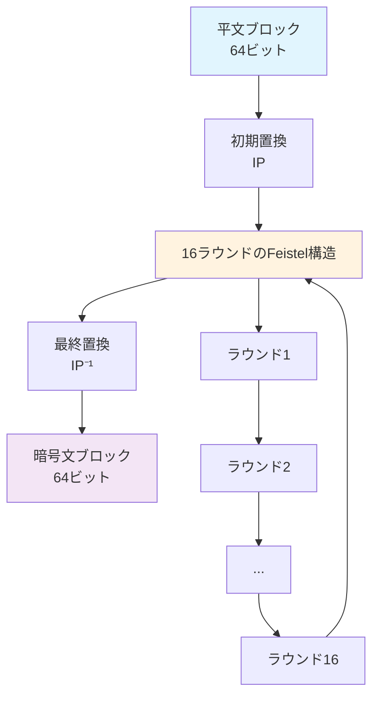
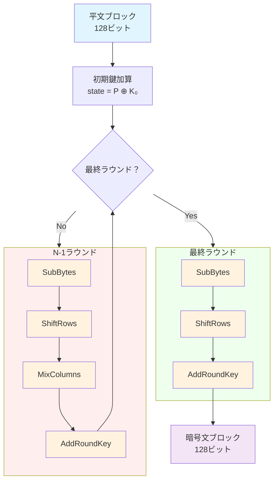
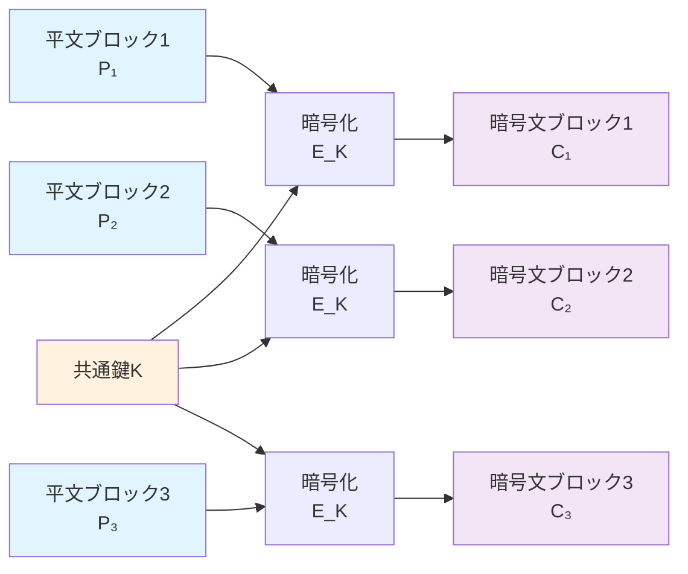
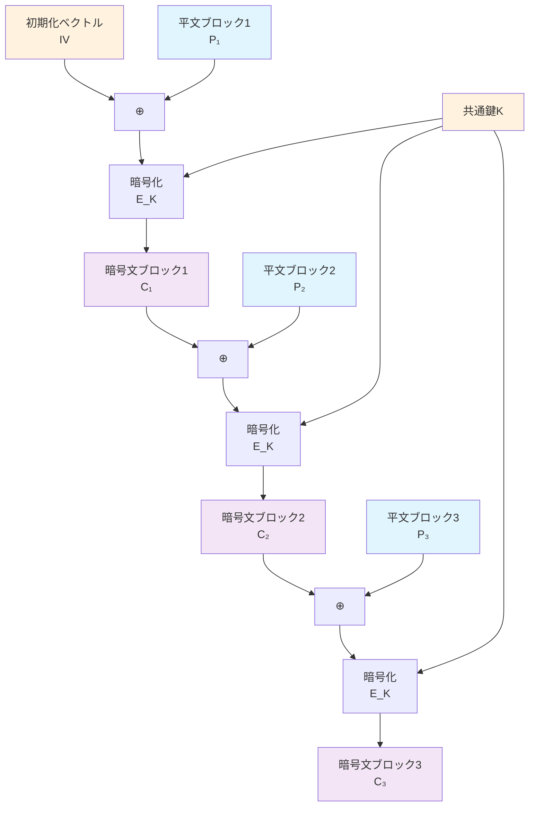
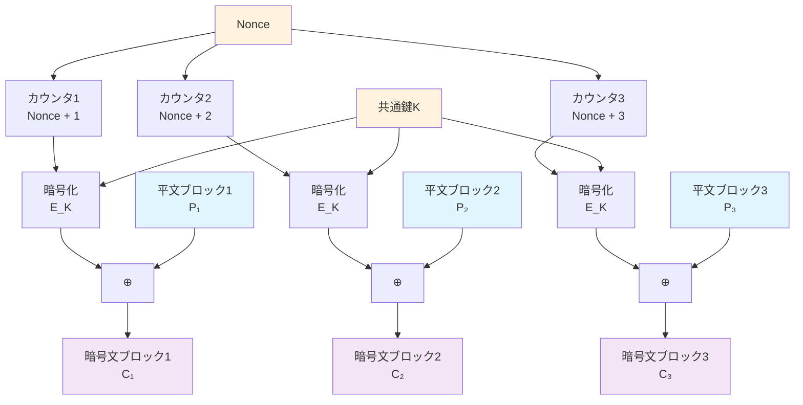
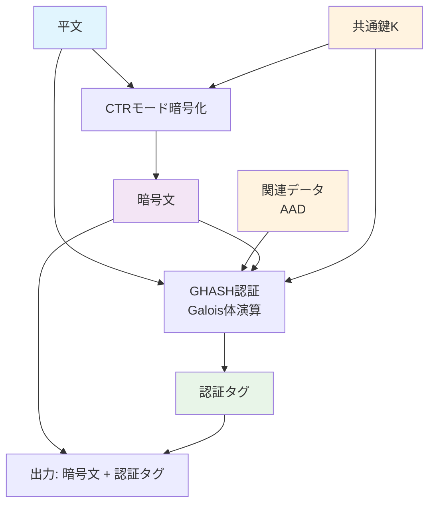
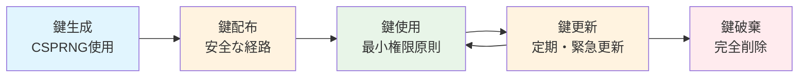
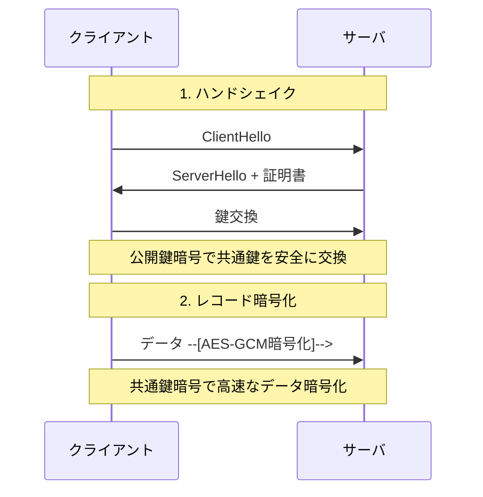
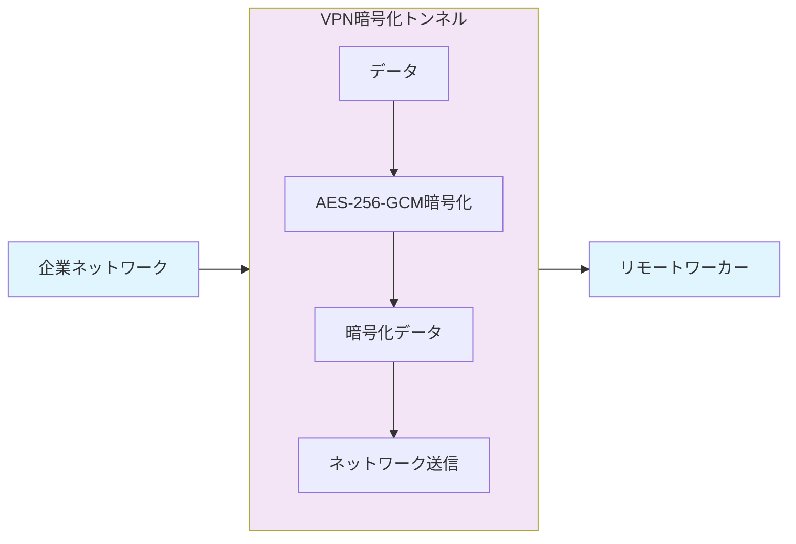
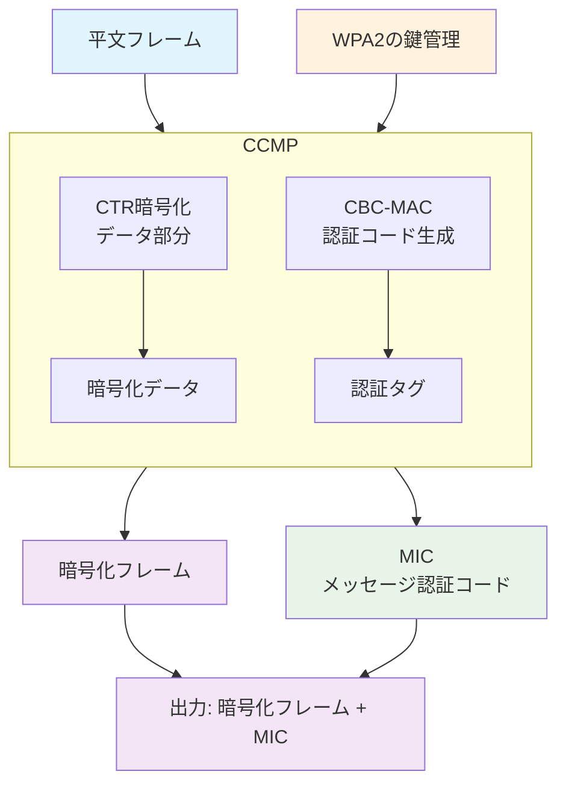

# 第2回　共通鍵暗号と暗号モード

今も世界中で膨大な量のデータが暗号化されています。Webサイトへのアクセス、メールの送受信、オンラインショッピング、動画の視聴——これらすべての背後で、**共通鍵暗号** が私たちのデータを守っています。

前回、私たちは暗号技術の基礎として、機密性・完全性・認証・否認防止といった目的や、計算量的困難性に基づく現代暗号の安全性の概要について学びました。今回は、その中でも最も身近で、最も重要な技術の一つである**共通鍵暗号** を学んでいきます。

なぜ「最も身近」なのか？それは、共通鍵暗号が私たちの日常生活のあらゆる場面で使われているからです。スマートフォンでWebサイトを見る時、会社のVPNに接続する時、パソコンのディスクが暗号化されている時——すべて共通鍵暗号の働きです。

今回は、その共通鍵暗号について学んでいきます。

連載記事の全体は、 「[第0回　暗号技術の基礎を学ぶ連載記事一覧](https://qiita.com/naoki_hayashida/items/deafc06c5df43715e334) 」を参照してください。

# 2.1 共通鍵暗号の概要

## 共通鍵暗号とは

共通鍵暗号は、データの暗号化において多くの場面で利用されている暗号技術です。共通鍵暗号の最大の特徴は「暗号化と復号で同じ鍵を使う」ことです。この性質から、共通鍵暗号は対称鍵暗号とも呼ばれます。


## 共通鍵暗号の性能

共通鍵暗号の最大の魅力は、その**圧倒的な高速性**にあります。現代のコンピュータでAES-256（256ビット鍵）による暗号化を実行すると、1秒間に数GBのデータを処理できます。これは、公開鍵暗号の数百倍から数千倍の速度です。

なぜこんなに速いのでしょうか？その秘密は、共通鍵暗号が**対称的な構造** を持っていることです。暗号化と復号がほぼ同じ処理で行えるため、ハードウェアでもソフトウェアでも、効率的に実装できるのです。

**共通鍵暗号の強み**
- **高速性**: 公開鍵暗号の数百倍〜数千倍程度の処理速度
- **効率性**: 大容量データの暗号化に最適
- **低リソース**: CPUやメモリの使用量が少ない
- **汎用性**: あらゆる種類のデータに適用可能

## 鍵配布問題：共通鍵暗号における最大の課題

しかし、この素晴らしい技術にも大きな課題があります。それが**鍵配布問題**です。

あなたが友人と秘密のメッセージをやり取りしたいとします。共通鍵暗号を使うなら、まず同じ鍵を安全に共有する必要があります。しかし、インターネット経由で鍵をそのまま送信してしまうと、盗聴者に鍵が漏れる可能性があります。

物理的な鍵配布なども行われていますが、現代においてはインターネットを経由した公開鍵暗号による解決が主に行われています。

**鍵配布問題の解決策**
- **公開鍵暗号による鍵交換**: Diffie-Hellman鍵交換など
- **物理的な鍵配布**: 安全な経路での事前配布
- **PKI（公開鍵基盤）**: 信頼できる第三者機関を活用

この問題の解決により、共通鍵暗号は多くの実用性を獲得し、現代の通信システムの基盤となっています。

# 2.2 ストリーム暗号とブロック暗号

共通鍵暗号の世界では、データをどのように処理するかによって、大きく二つの異なるアプローチが発展してきました。それが**ストリーム暗号**と**ブロック暗号**です。

この二つのアプローチは、異なる設計思想を持っています。ストリーム暗号は「流れるように、リアルタイムで」、ブロック暗号は「確実に、ブロック単位で」データを処理します。それぞれの特徴と使い分けを理解することで、なぜ現代の暗号システムがこれほど多様な用途に利用されているのかがわかります。

## ストリーム暗号

**ストリーム暗号**は、データを1ビットまたは1バイト単位で逐次暗号化していく方式です。この方式の最大の特徴は、データが到着するたび、即座に暗号化できることです。

```math
\begin{align}
\text{平文（ビット/バイト列）}&: P_1\ \ P_2\ \ P_3\ \ P_4\ \ P_5\ \ P_6\ \dots \\
\text{鍵（ビット/バイト列）}&: K_1\ \ K_2\ \ K_3\ \ K_4\ \ K_5\ \ K_6\ \dots \\
\text{暗号文（ビット/バイト列）}&: C_1\ \ C_2\ \ C_3\ \ C_4\ \ C_5\ \ C_6\ \dots 
\end{align}
```

### ストリーム暗号の魅力：リアルタイム性と効率性

ストリーム暗号の最大の魅力は、その**リアルタイム性**にあります。データが到着した瞬間に暗号化できるため、動画配信や音声通話のような、遅延が許されないアプリケーションに最適です。

**ストリーム暗号の強み**
- **リアルタイム処理**: データが到着した順序で即座に暗号化可能
- **低遅延**: バッファリングが不要で、処理遅延を最小化
- **メモリ効率**: 大きなブロックを保持する必要がない
- **シンプルな実装**: 比較的簡単に実装できる

### ストリーム暗号の進化

ストリーム暗号の歴史は、技術の進歩と攻撃手法の発見の歴史でもあります。

**RC4の登場**
RC4は1990年代から2000年代にかけて、SSL/TLSで広く使用されていたストリーム暗号でした。そのシンプルさと高速性から、多くのシステムで採用されました。しかし、2000年代に入って脆弱性が次々と発見され、現在では使用が推奨されていません。無線LANで利用されていたWEPもRC4を利用していたため、置き換えが進みました。

**ChaCha20の登場**
RC4の後継として登場したのが**ChaCha20**です。この暗号は、GoogleのDaniel J. Bernsteinによって設計され、現在ではGoogle ChromeやOpenSSHなど、多くのモダンなシステムで採用されています。ChaCha20の特徴は、ソフトウェア実装でも非常に高速で、かつ高い安全性を提供することです。

**KCipher-2**
KCipher-2は、2007年に九州大学とKDDI研究所から発表されたストリーム暗号アルゴリズムです。2012年に国際標準化されており、マシンパワーの低いモバイルデバイス向けなどの用途に期待されています。


**アルゴリズム定義**

*暗号化アルゴリズム*
- **入力**: 平文ビット列 $m_1, m_2, \dots, m_n$、秘密鍵 $k$
- **出力**: 暗号文ビット列 $c_1, c_2, \dots, c_n$
- **動作**: 
  - 鍵 $k$ から鍵ストリーム $k_1, k_2, \dots, k_n$ を生成
  - 各ビットを XOR: $c_i = m_i \oplus k_i$

*復号アルゴリズム*
- **入力**: 暗号文ビット列 $c_1, c_2, \dots, c_n$、秘密鍵 $k$
- **出力**: 平文ビット列 $m_1, m_2, \dots, m_n$
- **動作**:
  - 鍵 $k$ から同じ鍵ストリーム $k_1, k_2, \dots, k_n$ を生成
  - 各ビットを XOR: $m_i = c_i \oplus k_i = (m_i \oplus k_i) \oplus k_i$

### 攻撃手法と対策

ストリーム暗号に対する攻撃手法は、主にブルートフォース（全数探索）を行うもの、鍵ストリームの再利用を利用するもの、鍵ストリーム生成器の弱点を突くものに大別されます。

#### ブルートフォース攻撃（Brute Force Attack）

最も基本的な攻撃手法がブルートフォース攻撃です（ブロック暗号でも同じ）。攻撃者は全ての可能な鍵を順次試行し、正しい鍵を見つけ出すまで続けます。この攻撃の複雑度は鍵長に指数的に依存し、鍵長が $n$ ビットの場合、最大 $2^n$ 回の試行が必要です。

現代のコンピュータ技術を考慮すると、**128ビット以上の鍵長**が推奨されます。

#### 鍵ストリーム再利用攻撃（Stream Reuse Attack）

最も危険な攻撃手法の一つが鍵ストリームの再利用です。同じ鍵ストリーム $k_1, k_2, \ldots, k_n$ で異なる平文 $m_1$ と $m_2$ を暗号化すると、暗号文は $c_1 = m_1 \oplus k$ と $c_2 = m_2 \oplus k$ となります。この時、攻撃者が両方の暗号文を入手できれば、

$$
C_1 \oplus C_2 = (P_1 \oplus K) \oplus (P_2 \oplus K) = P_1 \oplus P_2
$$

となり、平文の差分が直接露出してしまいます。

この攻撃を防ぐためには、**一意なnonce（Number used once、一度だけ使われる数）やIV（Initialization Vector）** を使用して、同じ鍵でも異なる鍵ストリームを生成する必要があります。重要なのは、**同じ鍵とnonceのペアを二度と再利用しないこと**です。nonceは予測可能でも構いませんが、各暗号化に対して一意でなければなりません。また、鍵の適切な管理と更新も重要です。

#### 統計的攻撃（Statistical Attack）

鍵ストリーム生成器が真の乱数ではなく擬似乱数生成器である場合、生成される鍵ストリームに統計的な偏りが生じる可能性があります。攻撃者は大量の暗号文を収集し、その統計的性質を分析することで鍵ストリームの予測を試みます。

この攻撃に対する対策として、**暗号学的に安全な擬似乱数生成器（CSPRNG）** の使用が不可欠です。CSPRNGは、出力の統計的性質が真の乱数と区別できないことを保証します。

## ブロック暗号

**ブロック暗号**は、ストリーム暗号とは対照的に、固定長のブロック（通常128ビット）単位でデータを暗号化する方式です。この方式は、データを一定のサイズに分割して、それぞれを確実に処理していきます。

```math
\begin{align}
\text{平文（ブロックごと）}&: |\ P_1\ |\ \ P_2\ | \ P_3\ |\ \dots\ | \\
\text{暗号化処理（ブロックごと）}&: |\ E_1\ |\ E_2\ |\ E_3\ |\ \dots\ | \\
\text{暗号文（ブロックごと）}&: |\ C_1\ |\ C_2\ |\ C_3\ |\ \dots\ | 
\end{align}
```

### ブロック暗号の特徴：確実性と汎用性

ブロック暗号の最大の特徴は、その**確実性**と**汎用性**にあります。固定長のブロックで処理するため、各ブロックに対して同じ強度の暗号化を適用できます。

**ブロック暗号の強み**
- **固定ブロック**: 一定のサイズごとに確実に処理
- **高い安全性**: 各ブロックに対して同じ強度の暗号化
- **汎用性**: 様々な暗号モードと組み合わせ可能
- **標準化**: 多くの標準暗号がブロック暗号として設計

### ブロック暗号の進化：DESからAESへ

**DESの時代**
DES（Data Encryption Standard）は1977年に標準化された最初の民間向けブロック暗号でした。64ビットブロック、56ビット鍵という仕様で、当時としては画期的な技術でした。しかし、コンピュータ技術の進歩により、56ビット鍵は次第に脆弱になっていきました。

**AESの登場**
DESの後継として2001年に標準化されたのが**AES**（Advanced Encryption Standard）です。128ビットブロック、128/192/256ビット鍵という仕様で、現代の計算能力に対しても十分な安全性を提供しています。AESは現在、世界中で最も広く使用されている暗号アルゴリズムの一つです。

**アルゴリズム定義**

*暗号化アルゴリズム*
- **入力**: 平文ブロック $P$（固定長）、秘密鍵 $K$
- **出力**: 暗号文ブロック $C$（同じ固定長）
- **動作**:
  - 平文ブロック $P$ に対して鍵 $K$ を使用した複雑な置換・転置処理
  - $C = E_K(P)$（$E_K$ は鍵 $K$ による暗号化関数）

*復号アルゴリズム*
- **入力**: 暗号文ブロック $C$、秘密鍵 $K$
- **出力**: 平文ブロック $P$
- **動作**:
  - 暗号文ブロック $C$ に対して鍵 $K$ を使用した逆変換処理
  - $P = D_K(C)$（$D_K$ は鍵 $K$ による復号関数）

### 攻撃手法と対策

ブロック暗号に対する攻撃手法は、数学的な理論攻撃と物理的な実装攻撃に分類されます。これらの攻撃は、暗号アルゴリズムの設計段階と実装段階の両方で考慮する必要があります。

#### 差分解読法（Differential Cryptanalysis）

差分解読法は、BihamとShamirによって1980年後半に発見された攻撃手法です。この攻撃では、特定の差分を持つ平文ペアを選択し、対応する暗号文の差分パターンを分析することで、鍵の部分的な情報を取得します。

攻撃者は、平文の差分 $\Delta P = P \oplus P'$ と暗号文の差分 $\Delta C = C \oplus C'$ の関係を利用し、差分特性と呼ばれる確率的な関係を構築します。この差分特性が高い確率で成立する場合、鍵の一部を効率的に推定できる可能性があります。

この攻撃に対する対策として、**差分拡散性の高い設計**が重要です。S-boxの最適化や、ラウンド関数での差分の拡散を確実に行う設計手法が採用されています。

#### 線形解読法（Linear Cryptanalysis）

線形解読法は、Matsuiによって1993年に発表された攻撃手法です。この攻撃では、平文、暗号文、鍵の間に線形近似式を見つけ出し、その近似式の成立確率を利用して鍵の情報を取得します。

攻撃者は、平文の特定ビット $P[i_1] \oplus P[i_2] \oplus \ldots \oplus P[i_k]$ と暗号文の特定ビット $C[j_1] \oplus C[j_2] \oplus \ldots \oplus C[j_l]$ の間に線形関係が存在することを利用します。この線形近似式の成立確率が $1/2$ から大きく偏っている場合、大量の平文・暗号文ペアを分析することで鍵の一部を推定できます。

この攻撃を防ぐためには、**線形性の低い設計**が必要です。S-boxの線形性を最小化し、十分なラウンド数で線形近似の影響を減衰させることが重要です。

#### サイドチャネル攻撃（Side-Channel Attack）

サイドチャネル攻撃は、暗号アルゴリズムの実装時に発生する物理的な情報漏洩を利用する攻撃です。暗号処理時の電力消費、処理時間、電磁波漏洩、キャッシュアクセスパターンなどが攻撃の対象となります。

電力解析攻撃（Power Analysis）では、暗号処理時の電力消費パターンを分析することで、内部処理の情報を取得します。単純電力解析（SPA）と差分電力解析（DPA）の2種類があり、特にDPAは統計的手法を用いて微弱な電力変動から鍵情報を抽出します。

タイミング攻撃（Timing Attack）では、暗号処理の実行時間の違いを利用します。条件分岐やキャッシュヒット・ミスによる処理時間の変動から、内部状態や鍵の情報を推測します。

これらの攻撃に対する対策として、**定時間実装**、**電力解析対策**、**電磁波シールド**、**キャッシュ無効化**などが重要です。また、実装段階でのセキュリティ評価も不可欠です。

#### 辞書攻撃（Dictionary Attack）

辞書攻撃は、攻撃者が事前に準備した**辞書（リスト）**に含まれる候補値を順次試行する攻撃手法です。この攻撃は、特にパスワードや鍵の生成に人間の選択が関与する場合に非常に有効です。辞書攻撃は、ブルートフォース攻撃よりも効率的で、実際の攻撃で頻繁に使用される手法です。

**辞書攻撃の原理**

辞書攻撃では、攻撃者は以下の手順で攻撃を実行します。

1. **辞書の構築**: よく使用されるパスワード、鍵、フレーズのリストを事前に準備
2. **順次試行**: 辞書に含まれる候補値を順番に試行
3. **成功判定**: 正しい鍵やパスワードが見つかるまで継続

**辞書攻撃の例**

**単純辞書攻撃（Simple Dictionary Attack）**

最も基本的な辞書攻撃で、事前に準備した辞書の内容をそのまま試行します。

**攻撃対象**:
- 一般的なパスワード（"password", "123456", "admin"など）
- 辞書に載っている単語
- 人名、地名、組織名
- キーボードパターン（"qwerty", "asdfgh"など）

**辞書攻撃の成功要因**

辞書攻撃が成功する主な要因は以下の通りです。

1. **人間の選択パターン**: 人間は覚えやすいパスワードを選択する傾向がある
2. **辞書の充実**: 攻撃者が使用する辞書が現実的なパスワードを網羅している
3. **計算能力**: 現代のコンピュータは大量の候補を高速で試行可能
4. **並列処理**: 複数のマシンやGPUを利用した並列攻撃

**辞書攻撃の現代的発展**

**1. 機械学習を活用した辞書攻撃**

- **パターン学習**: 既知のパスワードからパターンを学習
- **文脈認識**: 攻撃対象の背景情報を活用

**2. 分散辞書攻撃**

- **ボットネット**: 複数のマシンを利用した並列攻撃
- **クラウド活用**: クラウドサービスの計算資源を利用
- **協調攻撃**: 複数の攻撃者が協力して辞書を構築

#### タイムメモリトレードオフ手法（Time-Memory Trade-off Attack）

タイムメモリトレードオフ手法は、Hellmanによって1980年に提案された攻撃手法で、**時間とメモリのトレードオフ**を利用して暗号攻撃の効率を向上させる手法です。この手法は、事前計算によるメモリ使用量の増加と引き換えに、実行時の計算時間を大幅に短縮します。

**Hellmanのタイムメモリトレードオフ攻撃**

この攻撃は、以下の3つのフェーズから構成されます。

1. **事前計算フェーズ**: 大量の平文・暗号文ペアを事前に計算し、テーブルとして保存
2. **オンライン攻撃フェーズ**: 実際の暗号文に対して、事前計算したテーブルを参照して鍵を探索
3. **偽陽性除去フェーズ**: テーブル参照で見つかった候補鍵の真偽を検証

**攻撃の数学的表現**

$n$ビット鍵に対する攻撃では、以下のパラメータが重要です。

- **テーブル数**: $t$個のテーブルを生成
- **チェーン長**: 各テーブルで$m$個のチェーンを構築
- **メモリ使用量**: $O(t \times m)$
- **計算時間**: $O(t \times m^2)$
- **成功率**: 約$t \times m^2 / 2^n$

**Rainbow Table攻撃**

Rainbow Tableは、Hellmanの手法を改良した攻撃手法で、Oechslinによって2003年に提案されました。この手法では、各チェーンで異なる還元関数を使用することで、チェーン間の衝突を大幅に削減し、より効率的な攻撃を実現します。

**Rainbow Tableの利点**

1. **衝突削減**: 異なる還元関数により、チェーン間の衝突が大幅に減少
2. **メモリ効率**: 同じ成功率をより少ないメモリで実現
3. **並列化**: 複数のテーブルを並列に構築・検索可能

**対策**

タイムメモリトレードオフ攻撃に対する対策として、以下の手法が重要です。

- **ソルト（Salt）の使用**: パスワードハッシュ化でランダムなソルトを追加し、事前計算テーブルの効果を無効化
- **十分な鍵長**: 鍵長を長くすることで、事前計算に必要なメモリ量を指数的に増加
- **鍵ストレッチング**: 鍵導出関数（KDF）を使用して計算コストを増加
- **動的パラメータ**: 暗号化時に動的にパラメータを変更し、事前計算を困難にする

#### ショートカット攻撃（Shortcut Attack）

ショートカット攻撃は、暗号アルゴリズムの数学的構造や設計上の弱点を利用して、ブルートフォース攻撃よりも効率的に鍵を破る攻撃手法の総称です。この攻撃では、暗号アルゴリズムの内部構造を詳細に分析し、鍵空間を効率的に絞り込むことで、計算量を大幅に削減します。

**ショートカット攻撃の例**

**代数攻撃（Algebraic Attack）**

暗号アルゴリズムを代数方程式系として表現し、代数的な手法で解を求める攻撃です。特に、S-boxやラウンド関数が代数的に表現可能な場合に有効です。
イメージとしては、暗号処理を巨大で多数の連立方程式に落とし込んで、それを解くことで鍵を見つけます。

**攻撃の流れ**:
1. 暗号アルゴリズムを多変数多項式方程式系として表現
2. Gröbner基底やSAT解法などの代数的解法を適用
3. 方程式系を解いて鍵を特定

## ブロック暗号の理論的保証の限界

現代のブロック暗号（AESなど）は、現在知られている攻撃手法に対して高い安全性を提供していますが、**理論的に完全な安全性を保証することは不可能**です。この限界について詳しく見ていきましょう。

### なぜ理論的保証が不可能なのか

#### 1. 未知の攻撃手法の存在

暗号学の歴史は、新しい攻撃手法の発見の歴史でもあります。DESが設計された1970年代には、差分解読法や線形解読法は知られていませんでした。同様に、現在のAESに対しても、将来新しい攻撃手法が発見される可能性があります。

**攻撃手法の発見例**:
- **1990年**: 差分解読法の発見（DES設計時は未知）
- **1993年**: 線形解読法の発見（DES設計時は未知）
- **2000年代**: サイドチャネル攻撃の体系化
- **2010年代**: 量子コンピュータによる攻撃の理論化

#### 2. 計算量的困難性の仮定

ブロック暗号の安全性は、**計算量的困難性の仮定**に基づいています。ブロック暗号で重要な仮定は以下の通りです。
- **差分解読の困難性**: 特定の差分特性を持つ平文ペアから鍵を効率的に求めることの困難性
- **線形解読の困難性**: 平文、暗号文、鍵の間の線形近似から鍵を効率的に求めることの困難性
- **代数攻撃の困難性**: 暗号アルゴリズムを代数方程式系として表現し、効率的に解くことの困難性
- **ブルートフォース攻撃の困難性**: 全鍵空間の探索による鍵発見の困難性

これらの仮定は、現在の数学的知識と計算技術に基づくものであり、将来的に新しい数学的手法や計算技術（量子コンピュータなど）によって覆される可能性があります。

#### 3. 実装とアルゴリズムの分離

暗号アルゴリズムの理論的安全性と、実際の実装における安全性は異なります。理論的に安全なアルゴリズムでも、実装時の以下の問題により安全性が損なわれる可能性があります。

- **サイドチャネル攻撃**: 電力消費、処理時間、電磁波漏洩
- **実装バグ**: プログラミングエラーや設計ミス
- **環境要因**: 温度、電圧、放射線などの物理的影響

### セキュリティマージンの重要性

**セキュリティマージン（Security Margin）** とは、暗号アルゴリズムの設計において、理論的な攻撃手法に対してどれだけの余裕を持って設計されているかを示す指標です。

**セキュリティマージンの定義**

セキュリティマージンは、以下の式で表現されます。

$$\text{セキュリティマージン} = \frac{\text{設計時の想定攻撃複雑度}}{\text{現在知られている最良の攻撃複雑度}}$$

**AESのセキュリティマージン例**:
- **AES-128**: 理論的な攻撃により計算量がわずかに削減（$2^{128}$から$2^{126}$へ）されるが、現実的な脅威ではない
- **AES-256**: 理論的な攻撃により計算量がわずかに削減（$2^{256}$から$2^{254}$へ）されるが、現実的な脅威ではない

### セキュリティマージンの設計原則

### 1. 十分な余裕の確保

暗号設計では、理論的な攻撃に対して十分な余裕を確保することが重要です。

### 2. 複数の攻撃手法への対応

単一の攻撃手法ではなく、複数の攻撃手法に対して同時にセキュリティマージンを確保する必要があります。

- **差分解読法**: 差分拡散性の確保
- **線形解読法**: 線形性の最小化
- **代数攻撃**: 代数的複雑性の確保
- **サイドチャネル攻撃**: 実装時の対策

### 3. 将来の技術進歩への対応

ムーアの法則による計算能力の向上や、新しい攻撃手法の発見を考慮して、長期的な安全性を確保する必要があります。

### まとめ：理論的保証の限界と実用的対応

ブロック暗号の安全性について、以下の点を理解することが重要です。

**理論的限界**:
- 未知の攻撃手法の発見可能性
- 計算量的困難性の仮定への依存
- 実装とアルゴリズムの分離

**実用的対応**:
- 十分なセキュリティマージンの確保
- 複数の攻撃手法への対策
- 定期的な安全性評価と更新

現代の暗号システムでは、**理論的完全性ではなく、実用的な安全性**を追求することが重要です。AESのような標準暗号は、現在知られている攻撃手法に対して十分なセキュリティマージンを持ち、実用的な安全性を提供しています。

## 比較とまとめ

| 項目     | ストリーム暗号   | ブロック暗号                  |
| -------- | ---------------- | ----------------------------- |
| 処理単位 | 1ビット〜1バイト | 固定ブロック（通常128ビット） |
| 遅延     | 低遅延           | ブロック単位での遅延          |
| 用途     | リアルタイム通信 | ファイル暗号化、多様な用途    |
| 実装     | 比較的シンプル   | 暗号モードの選択が重要        |

---

# 2.3 DESとAESの概要

1970年代に誕生したDESは、当時としては画期的な技術でした。しかし、ムーアの法則による計算能力の向上により、DESの安全性は次第に脅かされるようになりました。そして2001年、AESの標準化により、現代の暗号技術の新たな時代が始まったのです。

この章では、DESの栄光と挫折、そしてAESの誕生と成功という、暗号技術の歴史を彩る重要な物語を追っていきます。

## DES（Data Encryption Standard）

**DES**は1977年にアメリカ国立標準技術研究所（NIST）によって標準化された最初の民間向けブロック暗号です。

**仕様**
- **ブロック長**: 64ビット
- **鍵長**: 56ビット（実質）※ 64ビット鍵のうち8ビットはパリティビット
- **ラウンド数**: 16ラウンド

**DESの構造**
DESは**Feistel構造**と呼ばれる設計パターンを採用しています。



各ラウンドでは、ブロックを左右32ビットずつに分割し、右半分に複雑な変換を施してから左半分とXORを取る操作を繰り返します。

**Feistel構造の詳細**

Feistel構造は、Horst Feistelによって1970年代に考案された暗号設計手法で、DESの他にも多くのブロック暗号で採用されています。この構造の最大の特徴は、**暗号化と復号が同じアルゴリズムで実現できる**ことです。

**Feistel構造の基本原理**

Feistel構造では、各ラウンドで以下の処理を行います。

1. **ブロック分割**: 64ビットのブロックを左右32ビットずつに分割（L_i, R_i）
2. **右半分の処理**: 右半分R_iをラウンド関数Fで処理
3. **XOR演算**: 処理結果と左半分L_iをXOR
4. **左右交換**: 次のラウンドのために左右を交換

**ラウンド処理の数式表現**

i番目のラウンドの処理は以下のように表されます。

```math
\begin{align}
&L_i = R_{i-1} \\
&R_i = L_{i-1} \oplus F(R_{i-1}, K_i) \\
\\
&L_i, R_i：i番目ラウンドの左右32ビット \\
&K_i：i番目ラウンドの48ビット部分鍵 \\
&F：ラウンド関数（32ビット入力、32ビット出力）
\end{align}
```


**ラウンド関数Fの詳細**

DESのラウンド関数Fは以下の処理から構成されます。

1. **拡張置換（E-box）**: 32ビットを48ビットに拡張
2. **鍵加算**: 48ビットの部分鍵とのXOR
3. **S-box置換**: 8個のS-boxによる6ビット→4ビット変換
4. **P-box置換**: 32ビットの置換

**Feistel構造の利点**

1. **暗号化・復号の統一**: 同じアルゴリズムで暗号化と復号が可能
2. **設計の簡素化**: ラウンド関数Fの設計に集中できる
3. **安全性の向上**: 十分なラウンド数により高い安全性を実現
4. **実装の容易さ**: ハードウェア・ソフトウェア両方で効率的に実装可能

**復号時の動作**

Feistel構造の優れた点は、復号時も同じアルゴリズムを使用できることです。復号時は部分鍵を逆順（$K_{16}, K_{15}, \dots, K_1$）で使用します。

```math
\begin{align}
R_{i-1} &= L_i \\
L_{i-1} &= R_i \oplus F(L_i, K_i)
\end{align}
```

この構造により、DESは暗号化と復号で同じ回路を使用でき、実装コストを大幅に削減できます。

**DESの問題点**
- **鍵長不足**: 56ビット鍵は現在のコンピュータでは数時間でブルートフォース攻撃が可能
- **ブロック長**: 64ビットブロックは一部の攻撃に対して脆弱

**アルゴリズム定義**

*暗号化アルゴリズム*
- **入力**: 64ビット平文ブロック $P_{64}$、56ビット秘密鍵 $K_{56}$
- **出力**: 64ビット暗号文ブロック $C_{64}$
- **動作**:
  - 初期置換 (IP) を $P_{64}$ に適用
  - 16ラウンドのFeistel構造処理（各ラウンドで48ビット部分鍵を使用）
  - 最終置換 (IP$^{-1}$) を適用して $C_{64}$ を生成

*復号アルゴリズム*
- **入力**: 64ビット暗号文ブロック $C_{64}$、56ビット秘密鍵 $K_{56}$
- **出力**: 64ビット平文ブロック $P_{64}$
- **動作**:
  - 初期置換 (IP) を $C_{64}$ に適用
  - 16ラウンドのFeistel構造処理（部分鍵を逆順で使用）
  - 最終置換 (IP$^{-1}$) を適用して $P_{64}$ を復元

### 攻撃手法と対策

DESは暗号技術史上重要な役割を果たしましたが、現代の攻撃手法に対して脆弱性が明らかになり、現在では使用が推奨されていません。DESに対する主要な攻撃手法とその影響について詳しく見ていきましょう。

#### ブルートフォース攻撃（Brute Force Attack）

DESの最大の弱点は56ビットという短い鍵長です。1998年、Electronic Frontier Foundation（EFF）は専用ハードウェア「DES Cracker」を開発し、わずか22時間でDES鍵を破ることに成功しました。この攻撃は、DESの鍵空間が $2^56 ≈ 7.2 × 10^16$ 通りしかないことを利用したものです。

現代の汎用コンピュータでも、DES鍵の全探索は数時間から数日で可能となっており、実用的な暗号としての価値を完全に失っています。この攻撃に対する唯一の対策は、**AESへの完全な移行**です。

#### 差分解読法（Differential Cryptanalysis）

差分解読法は、BihamとShamirによって1990年に発表された攻撃手法で、DESに対して選択平文攻撃で $2^{47}$ の複雑度で鍵を破ることができることが示されました。この攻撃では、特定の差分特性を持つ平文ペアを選択し、暗号文の差分パターンを分析することで鍵の部分的な情報を取得します。

**差分特性**:
$$\Delta P = P \oplus P'$$
$$\Delta C = C \oplus C'$$

攻撃者は $\Delta P$ と $\Delta C$ の関係を利用して鍵の情報を取得します。

興味深いことに、DESの設計者たちは既に差分解読法を認識しており、DESのS-box設計でこの攻撃に対する対策を講じていました。しかし、当時はこの攻撃手法が公開されていなかったため、設計の意図が理解されていませんでした。

#### 線形解読法（Linear Cryptanalysis）

線形解読法は、Matsuiによって1993年に発表された攻撃手法で、DESに対して既知平文攻撃で $2^{43}$ の複雑度で鍵を破ることができることが示されました。この攻撃では、平文、暗号文、鍵の間に線形近似式を見つけ出し、大量の平文・暗号文ペアを分析することで鍵の情報を取得します。

**線形近似式**:
$$P[i_1] \oplus P[i_2] \oplus \dots \oplus P[i_k] \oplus C[j_1] \oplus C[j_2] \oplus \dots \oplus C[j_l] = 0$$

この近似式の成立確率が1/2から大きく偏っている場合、攻撃が成功します。

線形解読法も、DES設計時には未知の攻撃手法でした。この攻撃の発見により、現代の暗号設計では線形性の最小化が重要な設計要件となっています。

#### DES Crackerと専用ハードウェア攻撃

1998年のEFFによるDES Crackerは、暗号技術史上の重要な転換点でした。この専用ハードウェアは、約25万ドルのコストで構築され、1秒間に約920億回の鍵試行が可能でした。この攻撃は、**鍵長の根本的な不足**というDESの設計上の問題を明確に示しました。

**DESの根本的問題と対策**

DESの脆弱性は、1970年代の技術制約による設計に起因しています。当時、NSA（国家安全保障局）は56ビット鍵長を推奨しましたが、これは当時の技術水準を考慮したものでした。しかし、ムーアの法則による計算能力の向上により、この鍵長は現代では完全に不十分となっています。

DESの根本的な問題は、**鍵長の不足**と**設計時代の制約**にあります。これらの問題を解決する唯一の方法は、**AESへの完全な移行**です。AESは、DESの教訓を活かし、十分な鍵長と現代の攻撃手法に対する対策を組み込んで設計されています。

## AES（Advanced Encryption Standard）

DESの後継として、2001年にNISTによって標準化されたのが**AES**です。アルゴリズムの正式名称は**Rijndael**（ライダール）といいます。

**仕様**
- **ブロック長**: 128ビット
- **鍵長**: 128ビット、192ビット、256ビットから選択
- **ラウンド数**: 鍵長に応じて10/12/14ラウンド

**AESの構造**
AESは **SPN構造（Substitution-Permutation Network）** を採用しています。



各ラウンドの処理：
- **SubBytes**: S-boxによる非線形変換
- **ShiftRows**: 行のシフト操作
- **MixColumns**: 列の混合操作（最終ラウンドでは省略）
- **AddRoundKey**: ラウンド鍵とのXOR

**SPN構造の詳細**

SPN構造（Substitution-Permutation Network）は、Feistel構造とは異なる暗号設計手法で、AESの他にも多くの現代的なブロック暗号で採用されています。この構造の特徴は、**置換（Substitution）と転置（Permutation）を交互に繰り返す**ことで高い安全性を実現することです。

**SPN構造の基本原理**

SPN構造では、各ラウンドで以下の処理を順次実行します。

1. **置換層（Substitution Layer）**: S-boxによる非線形変換
2. **転置層（Permutation Layer）**: ビットの位置を変更する線形変換
3. **鍵加算層（Key Addition Layer）**: ラウンド鍵とのXOR

**AESの内部状態表現**

AESでは、128ビットのブロックを4×4バイトの行列として扱います。

```math
\text{state} = \begin{pmatrix}
s_{00} & s_{01} & s_{02} & s_{03} \\
s_{10} & s_{11} & s_{12} & s_{13} \\
s_{20} & s_{21} & s_{22} & s_{23} \\
s_{30} & s_{31} & s_{32} & s_{33}
\end{pmatrix}
```

各バイト $s_{ij}$ は8ビット（1バイト）を表し、全体で128ビットとなります。

**各処理の詳細**

**SubBytes（置換）**
- **目的**: 非線形性の導入
- **処理**: 各バイトをS-boxで置換
- **数学的表現**: $s'_{ij} = \text{S-box}(s_{ij})$
- **特徴**: 8ビット→8ビットの非線形変換

**ShiftRows（行シフト）**
- **目的**: 行間の拡散
- **処理**: 各行を異なる量だけ左シフト
  - 0行目: シフトなし
  - 1行目: 1バイト左シフト
  - 2行目: 2バイト左シフト
  - 3行目: 3バイト左シフト

**数学的表現**:
$$\text{ShiftRows}(s_{ij}) = s_{i,(j+i) \bmod 4}$$

**MixColumns（列混合）**
- **目的**: 列間の拡散
- **処理**: 各列にGF(2^8)上の行列乗算を適用
- **数学的表現**: $c'_i = M \times c_i$ （Mは固定の4×4行列）
- **特徴**: 線形変換による拡散効果

**固定行列M**:
$$M = \begin{bmatrix}
02 & 03 & 01 & 01 \\
01 & 02 & 03 & 01 \\
01 & 01 & 02 & 03 \\
03 & 01 & 01 & 02
\end{bmatrix}$$

ここで、各要素はGF(2^8)上の値です。

**AddRoundKey（鍵加算）**
- **目的**: 鍵の影響を導入
- **処理**: 状態行列とラウンド鍵のXOR
- **数学的表現**: $s'_{ij} = s_{ij} \oplus k_{ij}$
- **特徴**: 単純なXOR演算

**SPN構造の利点**

1. **高い拡散性**: 置換と転置の組み合わせにより、1ビットの変化が全体に迅速に拡散
2. **並列処理**: 各処理が独立して実行可能
3. **設計の透明性**: 各処理の役割が明確
4. **安全性の証明**: 数学的に安全性を証明しやすい構造

**Feistel構造との比較**

| 項目         | Feistel構造        | SPN構造            |
| ------------ | ------------------ | ------------------ |
| 暗号化・復号 | 同じアルゴリズム   | 異なるアルゴリズム |
| 拡散性       | 段階的             | 高速               |
| 並列性       | 制限的             | 高い               |
| 設計         | ラウンド関数に集中 | 各処理を独立設計   |
| 実装         | ハードウェアに有利 | ソフトウェアに有利 |

**AESでのSPN構造の実装**

AESでは、SPN構造を以下のように実装しています。

- **置換層**: SubBytes（S-box置換）
- **転置層**: ShiftRows + MixColumns（行シフト + 列混合）
- **鍵加算層**: AddRoundKey（ラウンド鍵とのXOR）

この構造により、AESは高い安全性と効率的な実装を両立しています。

**AESの優位性**
- **十分な鍵長**: AES-256では事実上ブルートフォース攻撃不可能
- **高速性**: ハードウェア・ソフトウェア両方で高速実装可能
- **柔軟性**: 3つの鍵長から用途に応じて選択可能
- **標準化**: 世界中で採用されている信頼性

**鍵空間の比較**:
- AES-128: $2^{128} \approx 3.4 \times 10^{38}$ 通り
- AES-192: $2^{192} \approx 6.3 \times 10^{57}$ 通り  
- AES-256: $2^{256} \approx 1.2 \times 10^{77}$ 通り

**アルゴリズム定義**

*暗号化アルゴリズム*
- **入力**: 128ビット平文ブロック $P_{128}$、秘密鍵 $K$ (128/192/256ビット)
- **出力**: 128ビット暗号文ブロック $C_{128}$
- **動作**:
  - 初期鍵加算: $\text{state} = P_{128} \oplus K_0$
  - N-1ラウンド: SubBytes → ShiftRows → MixColumns → AddRoundKey
  - 最終ラウンド: SubBytes → ShiftRows → AddRoundKey
  - 結果として $C_{128}$ を出力

*復号アルゴリズム*
- **入力**: 128ビット暗号文ブロック $C_{128}$、秘密鍵 $K$ (128/192/256ビット)
- **出力**: 128ビット平文ブロック $P_{128}$
- **動作**:
  - 逆初期鍵加算: $\text{state} = C_{128} \oplus K_N$
  - N-1ラウンド: AddRoundKey → InvMixColumns → InvShiftRows → InvSubBytes
  - 最終ラウンド: AddRoundKey → InvShiftRows → InvSubBytes
  - 結果として $P_{128}$ を復元

### 攻撃手法と対策

AESは、DESの教訓を活かして設計された現代の標準暗号であり、現在知られている攻撃手法に対して高い安全性を提供しています。しかし、理論的な攻撃手法と実装上の脆弱性について理解することは重要です。

#### ブルートフォース攻撃（Brute Force Attack）

AESの鍵長は128ビット、192ビット、256ビットから選択可能であり、現在の技術ではブルートフォース攻撃は実現不可能です。AES-128の場合、鍵空間は $2^{128} \approx 3.4 \times 10^{38}$ 通りとなり、現在の最速スーパーコンピュータでも宇宙の年齢より長い時間が必要です。

AES-256の場合、鍵空間は $2^{256} \approx 1.2 \times 10^{77}$ 通りとなり、物理的に不可能な計算量となります。このため、**十分な鍵長の選択**により、ブルートフォース攻撃に対する安全性が確保されています。

#### 差分解読法（Differential Cryptanalysis）

AESは設計段階で差分解読法を考慮しており、差分拡散性の高い設計が採用されています。現在知られている最良の差分解読攻撃でも、AES-128に対して $2^{126}$、AES-256に対して $2^{254}$ の複雑度が必要です。

これらの攻撃は、理論的には存在するものの、実用的な攻撃として実行することは不可能です。AESのS-box設計とラウンド関数の構造により、差分特性の確率が十分に低く抑えられています。

#### 線形解読法（Linear Cryptanalysis）

線形解読法に対しても、AESは設計段階で対策が講じられています。現在知られている最良の線形解読攻撃でも、AES-128に対して $2^{126}$、AES-256に対して $2^{254}$ の複雑度が必要です。

AESのS-boxは、線形性を最小化するように設計されており、十分なラウンド数により線形近似の影響が効果的に減衰されます。このため、実用的な線形解読攻撃は困難です。

#### サイドチャネル攻撃（Side-Channel Attack）

AESのアルゴリズム自体は安全ですが、実装段階でのサイドチャネル攻撃に対する脆弱性が存在する可能性があります。

キャッシュタイミング攻撃（Cache Timing Attack） では、AESのS-boxアクセスパターンによるキャッシュヒット・ミスの違いを利用します。攻撃者は、S-boxのテーブルアクセスによる処理時間の変動を分析することで、鍵の情報を取得しようとします。

電力解析攻撃（Power Analysis） では、AES処理時の電力消費パターンを分析します。特に、S-boxアクセスや鍵加算処理時の電力変動から鍵の情報を抽出する攻撃が知られています。

これらの攻撃に対する対策として、**定時間実装**、**キャッシュ無効化**、**電力解析対策**、**電磁波シールド**などが重要です。また、実装段階でのセキュリティ評価も不可欠です。

#### 関連鍵攻撃（Related-Key Attack）

関連鍵攻撃は、関連する複数の鍵を使用した攻撃です。AESに対して、特定の条件下で関連鍵攻撃が報告されていますが、これらの攻撃は実用的な脅威とはなりません。

この攻撃を防ぐためには、**鍵の独立性確保**と**適切な鍵管理**が重要です。鍵生成時には十分なエントロピーを確保し、鍵の再利用を避けることが必要です。

### AESの安全性評価

AESの安全性は、以下の要因により確保されています。

**数学的安全性**: 現在知られている攻撃手法では実用的な攻撃は困難です。差分解読法と線形解読法に対する設計段階での対策により、理論的な攻撃の複雑度が十分に高く保たれています。

**設計の堅牢性**: AESは、DESの教訓を活かし、差分解読法と線形解読法を考慮した設計が採用されています。S-boxの最適化、ラウンド関数の構造、十分なラウンド数により、高い安全性が実現されています。

**実装の重要性**: AESのアルゴリズム自体は安全ですが、実装段階でのセキュリティ対策が重要です。サイドチャネル攻撃に対する対策や、適切な鍵管理の実装が不可欠です。

## DESからAESへの移行

| 項目       | DES              | AES               |
| ---------- | ---------------- | ----------------- |
| 標準化年   | 1977年           | 2001年            |
| ブロック長 | 64ビット         | 128ビット         |
| 鍵長       | 56ビット         | 128/192/256ビット |
| 構造       | Feistel          | SPN               |
| 現在の状況 | 非推奨           | 現行標準          |
| 主な用途   | レガシーシステム | あらゆる用途      |

この移行により、現代の高い計算能力に対しても十分な安全性を持つ暗号システムが実現されました。


# 2.4 暗号モードの概要

ブロック暗号を実際に使用する際、単一のブロック暗号だけでは複数のブロックを安全に暗号化できません。そこで重要になるのが**暗号モード**です。

## なぜ暗号モードが必要なのか

AESなどのブロック暗号は、同じ平文ブロックに対して常に同じ暗号文ブロックを生成します。この性質は一見便利に見えますが、実際の使用では深刻な問題を引き起こします。

**問題の具体例**
```
平文1: "Hello World!!!!!" → 暗号文1: "A1B2C3D4E5F6G7H8"
平文2: "Hello World!!!!!" → 暗号文2: "A1B2C3D4E5F6G7H8" （同じ！）
```

このパターンから攻撃者は情報を推測できてしまいます。例えば、画像ファイルを暗号化した場合、同じ色の部分が同じ暗号文になってしまい、元の画像の輪郭が透けて見えてしまう可能性があります。

暗号モードは、この問題を解決し、複数ブロックを安全に暗号化するための手法です。各モードは異なるアプローチで、ブロック暗号の弱点を補強します。

## 主要な暗号モード

### 1. ECB（Electronic Codebook）モード

**最もシンプルなモード**ですが、**実用では使用すべきではありません**。



**問題点**
- 同じ平文ブロックが同じ暗号文ブロックになる
- ブロック単位でのパターンが見える
- 平文の統計的性質が暗号文に反映される

### 2. CBC（Cipher Block Chaining）モード

**前のブロックの暗号文を次のブロックの暗号化に使用**するモードです。



**特徴**
- **連鎖効果**: 前のブロックが後のブロックに影響
- **初期化ベクトル（IV）**: ランダムな値で最初のブロックを初期化
- **順次処理**: 前のブロックの結果が必要なため並列化困難

**利点**
- ECBの問題を解決
- 広く採用されている実績

**課題**
- エラー伝播：1ビットの誤りが2ブロックに影響
- 並列化ができない

### 3. CTR（Counter）モード

**カウンタ値を暗号化してストリーム暗号として使用**するモードです。



**特徴**
- **並列処理可能**: 各ブロックが独立して処理できる
- **ランダムアクセス**: 任意の位置から復号可能
- **ストリーム暗号的**: ブロック暗号をストリーム暗号として利用

**利点**
- 高速（並列処理可能）
- エラー伝播なし
- パディング不要

**注意点**
- カウンタ値とキーの組み合わせを絶対に再利用してはいけない
- 同じキーで異なるメッセージを暗号化する場合、カウンタの管理が重要

### 4. GCM（Galois/Counter Mode）モード

**暗号化と認証を同時に提供** する **AEAD（Authenticated Encryption with Associated Data）** モードです。



**特徴**
- **機密性と完全性**: 暗号化と同時にメッセージ認証も実現
- **高速**: ハードウェア実装で非常に高速
- **関連データ**: 暗号化しないが認証したいデータも保護可能

**利点**
- 一つのモードで暗号化と認証の両方を実現
- TLS 1.3などモダンなプロトコルで標準採用
- ネットワーク通信に最適

## 暗号モードの比較

| モード | 安全性 | 並列化 | エラー伝播 | 用途           |
| ------ | ------ | ------ | ---------- | -------------- |
| ECB    | ❌ 低い | ⭕ 可能 | ⭕ なし     | 使用禁止       |
| CBC    | ⭕ 高い | ❌ 不可 | ❌ あり     | ファイル暗号化 |
| CTR    | ⭕ 高い | ⭕ 可能 | ⭕ なし     | 高速通信       |
| GCM    | ⭕ 最高 | ⭕ 可能 | ⭕ なし     | TLS通信        |

---

# 2.5 暗号の安全性と鍵管理

暗号技術の安全性は、アルゴリズムの設計だけでなく、**鍵管理**の質によって大きく左右されます。どんなに優れた暗号アルゴリズムを使用しても、鍵の管理が不適切であれば、セキュリティは保たれません。

この章では、暗号の安全性を決定する鍵長の重要性と、鍵管理のライフサイクルについて詳しく見ていきます。また、なぜDESが危険になったのか、そしてAESがなぜ安全なのか、その背景にある技術的・歴史的な要因を探ります。

## 鍵長と安全性の関係

暗号の安全性は主に**鍵長**によって決まります。鍵長が長いほど、ブルートフォース攻撃（全ての鍵を試す攻撃）に必要な計算量が指数的に増加します。これは数学的に保証された事実です。

### 計算量の比較

| 鍵長                 | 可能な鍵の数                         | ブルートフォース攻撃時間（仮定） |
| -------------------- | ------------------------------------ | -------------------------------- |
| 56ビット（DES）      | $2^{56} \approx 7.2 \times 10^{16}$  | 数時間〜数日                     |
| 128ビット（AES-128） | $2^{128} \approx 3.4 \times 10^{38}$ | 宇宙の寿命より長い               |
| 256ビット（AES-256） | $2^{256} \approx 1.2 \times 10^{77}$ | 物理的に不可能                   |

### なぜDESが危険になったのか

1977年のDES制定時、56ビット鍵は十分安全とされていました。しかし：

1. **コンピュータ性能の向上**: ムーアの法則により処理能力が指数的に向上
2. **専用ハードウェア**: 1998年にEFF（Electronic Frontier Foundation）がDES Crackerを製作し、22時間でDES鍵を破った
3. **クラウドコンピューティング**: 現在では数時間、低コストでDESを破ることが可能

**ムーアの法則の影響**:
処理能力は約18ヶ月で2倍になるため、$n$年後の処理能力は $2^{2n/3}$ 倍になります。

## 鍵管理の重要性

どんなに強力な暗号アルゴリズムを使用しても、**鍵管理**が不適切であれば安全性は保たれません。

### 鍵管理のライフサイクル



#### 1. 鍵生成
- **真の乱数**: 暗号学的に安全な擬似乱数生成器（CSPRNG）を使用
- **エントロピー**: 十分な不確実性を持つ鍵の生成
- **初期化**: ハードウェア乱数生成器やOS提供の乱数機能を活用

#### 2. 鍵配布
- **帯域外配布**: 暗号化通信とは別の安全な経路での配布
- **鍵交換プロトコル**: Diffie-Hellman鍵交換等の使用
- **PKI（Public Key Infrastructure）**: 公開鍵暗号基盤の活用

#### 3. 鍵使用
- **最小権限原則**: 必要最小限の範囲でのみ鍵を使用
- **使用回数制限**: 同一鍵の過度な使用を避ける
- **保護**: メモリ内での鍵の適切な保護

#### 4. 鍵更新
- **定期更新**: 一定期間ごとの鍵の更新
- **緊急更新**: 鍵漏洩の疑いがある場合の即座な更新
- **後方互換性**: 更新期間中の旧鍵のサポート

#### 5. 鍵破棄
- **確実な削除**: メモリやストレージからの完全削除
- **上書き**: 機密データの痕跡を残さない処理
- **物理的破壊**: 必要に応じたハードウェアの物理的破壊

## モード選択がセキュリティに与える影響

**間違ったモード選択の例**

暗号モードの選択は、セキュリティに直接的な影響を与えます。以下に、危険な選択と安全な選択の例を示します。

**危険な選択：ECBモード**
- **問題**: 同じ平文ブロックが常に同じ暗号文ブロックになる
- **影響**: パターンが露出し、統計的攻撃が可能
- **対策**: 実用では絶対に使用しない

**安全な選択：GCMモード**
- **利点**: 暗号化と認証を同時に実現
- **特徴**: 改ざん検出機能付き
- **適用**: 現代の通信プロトコルで標準採用

**セキュリティ要件に応じたモード選択**
- **ファイル暗号化**: CBCモード（完全性は別途MAC）
- **高速通信**: CTRモード（完全性は別途MAC）
- **TLS通信**: GCMモード（暗号化と認証を同時実現）
- **古いシステム**: CBCモード（広く対応されている）

# 2.6 現実世界での応用例：理論が実践で活かされる瞬間

これまで学んできた共通鍵暗号の理論は、私たちの身の回りの多くの技術で実際に活用されています。理論と実践の橋渡しをすることで、なぜこれらの技術が安全で効率的なのかが理解できるようになります。

この章では、共通鍵暗号がどのように実世界で使われているかを、具体的な例を通じて見ていきます。Webブラウジング、VPN接続、ディスク暗号化、Wi-Fi通信——これらすべての背後で、共通鍵暗号が静かに、しかし確実に働いています。

## TLS通信におけるAES-GCM

**TLS（Transport Layer Security）** は、HTTPSやその他の安全な通信プロトコルの基盤となる技術です。

### TLS 1.3での暗号化フロー



**なぜAES-GCMが選ばれるのか**
- **高速性**: 大量のWebトラフィックを効率的に処理
- **認証付き**: データの改ざんを同時に検出
- **ハードウェア支援**: 現代のCPUに最適化された実装

**実際の使用例**
- Webブラウジング時のHTTPS通信
- APIサーバとの通信
- モバイルアプリの通信

## VPNとディスク暗号化

### VPN（Virtual Private Network）

VPNでは、インターネット上に安全なトンネルを構築するために共通鍵暗号が使用されます。

**代表的なVPNプロトコル**
- **OpenVPN**: AES-CBCまたはAES-GCM
- **IPsec**: AES-CTR + HMAC-SHA256
- **WireGuard**: ChaCha20-Poly1305（軽量で高速）



### ディスク暗号化

**ストレージ全体の暗号化**では、特殊な暗号モードが使用されます。

**XTS-AES（XEX-based tweaked-codebook mode with ciphertext stealing）**
- **セクタベース**: ディスクのセクタ単位で暗号化
- **並列処理**: 高速なランダムアクセスが可能
- **改ざん検出**: セクタ改ざんに対する一定の保護

**実装例**
- **BitLocker（Windows）**: AES-XTS
- **FileVault（macOS）**: AES-XTS
- **LUKS（Linux）**: AES-XTS
- **Android暗号化**: AES-256-XTS

## 無線LAN（Wi-Fi）のセキュリティ

### WPA2のCCMP

**CCMP（Counter Mode with Cipher Block Chaining Message Authentication Code Protocol）** は、実質的にAES-CCMモードの実装です。



**CCMPの特徴**
- **AESベース**: 128ビットAESを使用
- **CTR暗号化**: データ部分の暗号化
- **CBC-MAC**: メッセージ認証コード付与

### WPA3のさらなる強化

**WPA3**では、より強力な暗号化が導入されています。
- **AES-256**: より長い鍵長
- **SAE（Simultaneous Authentication of Equals）**: より安全な鍵交換

## IoTデバイスでの軽量暗号

**IoT（Internet of Things）** デバイスでは、限られた計算資源での暗号化が求められます。

**軽量ブロック暗号の例**
- **AES-128**: 比較的軽量で広く対応
- **ChaCha20**: ソフトウェア実装で高速
- **PRESENT**: 非常に軽量（64ビットブロック）

## クラウドストレージの暗号化

**クラウドサービス**では、大規模なデータ暗号化が必要です。

**Amazon S3の暗号化例**
- **SSE-S3**: AES-256による透明な暗号化
- **SSE-KMS**: 鍵管理サービスと連携
- **CSE**: クライアントサイド暗号化

**Google Cloudの暗号化**
- **AES-256**: 保存時暗号化の標準
- **エンベロープ暗号化**: 階層的な鍵管理

# 2.7 まとめ

私たちは今回、共通鍵暗号の世界を一つの大きなストーリーとして旅してきました。シンプルなアイデアから始まって、ストリーム暗号とブロック暗号の違い、DESからAESへの進化、暗号モードの重要性、そして実世界での応用まで——すべてが一つの流れの中で理解できるよう構成しました。

なぜ現代のデジタル社会が安全に機能しているのか、その背景にある技術的な仕組みが見えてきたはずです。

### 第2回で学んだこと

本記事では、**共通鍵暗号**の基礎から応用まで幅広く学びました。重要なポイントを整理します。

### 学んだ内容

#### 1. 共通鍵暗号の基本概念
- 暗号化と復号に同じ鍵を使用
- 高速性と効率性が最大の特徴
- 鍵配布問題という重要な課題

#### 2. ストリーム暗号 vs ブロック暗号
- ストリーム暗号：逐次処理、低遅延、リアルタイム向け
- ブロック暗号：固定ブロック処理、汎用性、多様なモード

#### 3. DESからAESへの発展
- DES：56ビット鍵の限界と歴史的意義
- AES：現代の標準、十分な安全性と高い性能

#### 4. 暗号モードの重要性
- ECB：使用禁止
- CBC：従来の標準、エラー伝播の問題
- CTR：並列処理可能、高速
- GCM：暗号化+認証、現代の最適解

#### 5. 安全性と鍵管理
- 鍵長による安全性の決定
- 鍵管理ライフサイクルの重要性
- 適切なモード選択の必要性

#### 6. 現実世界での応用
- TLS通信：HTTPS、API通信
- VPN：リモートアクセス、企業ネットワーク
- ディスク暗号化：データ保護
- 無線LAN：Wi-Fiセキュリティ

## 次回：完全性と認証の世界へ

次回は「[**第3回　ハッシュ関数とメッセージ認証コード（MAC）**](https://qiita.com/naoki_hayashida/items/f477faba0d30debd909a)」について学びます。今回学んだ共通鍵暗号が「**機密性**」を主に担当するのに対し、次回の暗号技術は「**完全性**」や「**認証**」を担当します。
