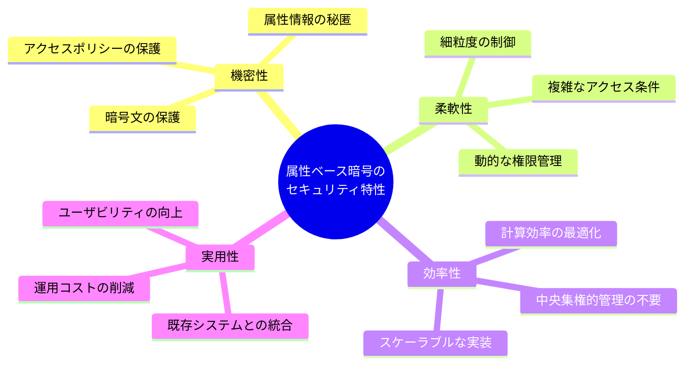
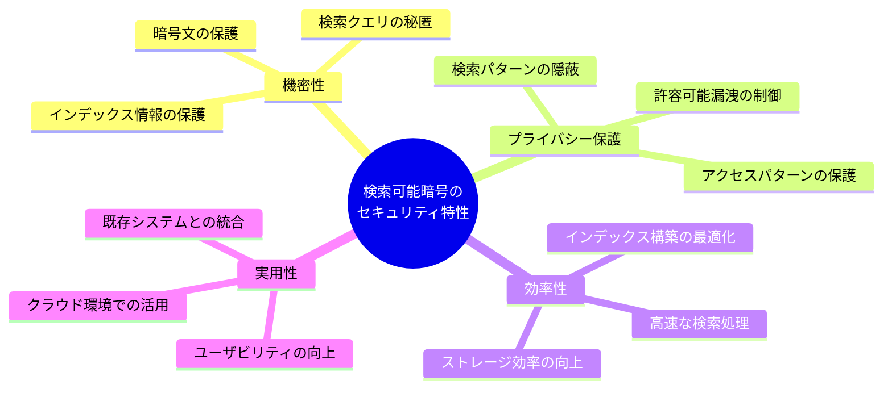
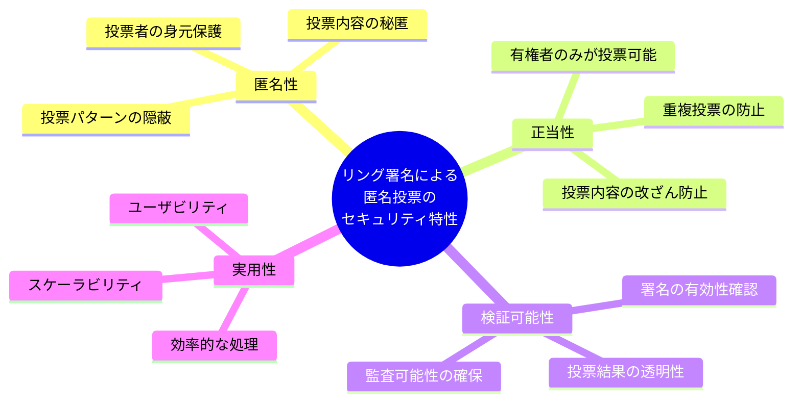
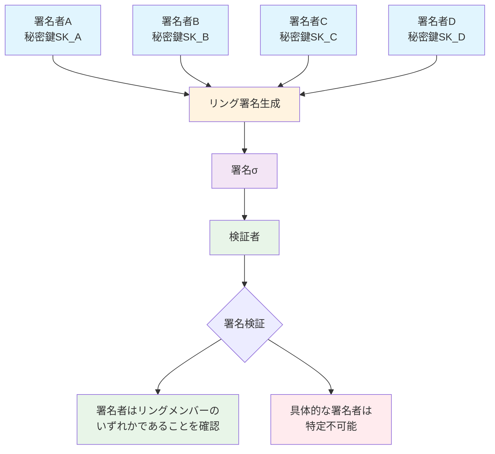
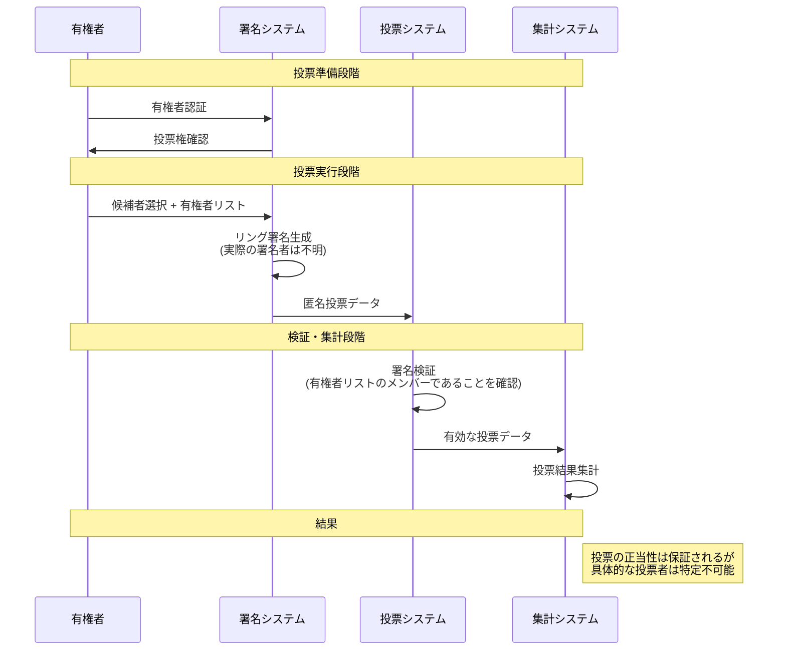

# 第6回　高機能暗号とその応用

前回の第5回では、離散対数問題に基づく暗号技術について学びました。RSA暗号や楕円曲線暗号といった従来の公開鍵暗号は、データの暗号化と復号、署名の生成と検証という基本的な機能を提供します。

しかし、現代のディジタル社会では、これらの基本機能だけでは対応できない要求が生まれています。クラウドストレージに保存された暗号化データを検索したい、ユーザーの属性に基づいて柔軟なアクセス制御を行いたい、匿名性を保ちながら署名を生成したいといった要求です。

これらの要求に応えるのが **高機能暗号（Advanced Cryptography / Functional Cryptography）** です。高機能暗号は、暗号化されたデータに対して検索や計算、アクセス制御などの高度な操作を可能にし、プライバシーを保ちながら実用的なシステムを構築できます。

連載記事の全体は、 「[第0回　暗号技術の基礎を学ぶ連載記事一覧](https://qiita.com/naoki_hayashida/items/deafc06c5df43715e334) 」を参照してください。

# 6.1 高機能暗号の全体像

## 従来暗号の限界

従来の暗号では、データを暗号化すると復号するまでそのデータに対して何も操作できませんでした。この制約により、以下のような問題が生じます。

- クラウドストレージに暗号化データを保存しても、検索ができない
- 複数のユーザーに異なる権限でデータを共有することが困難
- 匿名性を保ちながら署名を生成することができない

## 高機能暗号の解決策

高機能暗号は、これらの問題を解決するために開発されました。暗号化された状態で以下の操作が可能になります。

**検索可能暗号**: 暗号文のままキーワード検索を実行
**属性ベース暗号**: ユーザーの属性に基づいて復号権限を制御  
**グループ署名・リング署名**: 匿名性を保ちながら署名を生成

## 数学的基盤

高機能暗号の実現には、従来の暗号では使用されなかった数学的構造が必要です。次に、これらの高度な機能を可能にする数学的基盤について説明します。

特に重要なのは **双線型ペアリング** です。双線型ペアリングは、2つの楕円曲線上の点を入力として、第3の群の要素を出力する写像です。この写像は双線型性という特殊な性質を持ち、属性ベース暗号やグループ署名の実現に不可欠です。

双線型ペアリングの定義：
- 群 $ G_1, G_2, G_T $ と写像 $ e: G_1 \times G_2 \rightarrow G_T $
- 双線型性：$ e(aP, bQ) = e(P, Q)^{ab} $
- 非退化性：$ G_1 $ の生成元 $ P $ と $ G_2 $ の生成元 $ Q $ に対し、$ e(P, Q) $ は $ G_T $ の単位元ではない
- 計算効率性：ペアリングは効率的に計算可能である

この数学的基盤により、従来の暗号では実現できなかった高度な機能が可能になります。

# 6.2 属性ベース暗号：柔軟なアクセス制御の実現

## 従来のアクセス制御の課題

従来の公開鍵暗号では、特定の受信者の公開鍵で暗号化するため、その受信者にのみ復号権限が与えられます。しかし、実際のシステムでは、より柔軟なアクセス制御が必要です。

例えば、企業の機密文書を「管理職かつ技術部門のメンバー、または上級レベルの従業員」にのみ閲覧可能にしたい場合、従来の方式では複数の受信者に対して個別に暗号化する必要があり、非効率です。

## 属性ベース暗号の仕組み

**属性ベース暗号（ABE）** は、この問題を解決します。ABEでは、ユーザーの属性（役職、部署、権限など）に基づいて復号権限を制御できます。

ABEの基本概念：
- **属性**: ユーザーやデータに関連する特性（例：`role=manager`, `department=engineering`）
- **アクセスポリシー**: 復号に必要な属性の条件（例：`(role=manager AND department=engineering) OR level=senior`）

## ABEの2つの方式

ABEには、ポリシーをどこに配置するかによって2つの方式があります。

**KP-ABE（Key-Policy ABE）**
- ユーザーの秘密鍵にアクセスポリシーが埋め込まれる
- 暗号文には属性が関連付けられる
- ユーザーがどのデータにアクセスできるかを事前に決定

**CP-ABE（Ciphertext-Policy ABE）**
- 暗号文にアクセスポリシーが埋め込まれる
- ユーザーの秘密鍵には属性が関連付けられる
- データ作成者がアクセス条件を指定

CP-ABEの方が実用的で、以下のアルゴリズムで動作します。

1. **システム設定**: マスター秘密鍵 $ \text{MSK} $ とシステムパラメータ $ \text{PP} $ を生成
2. **鍵生成**: 属性集合 $ S $ とマスター秘密鍵から秘密鍵 $ \text{SK}_S $ を生成
3. **暗号化**: アクセスポリシー $ \mathcal{P} $ と平文 $ M $ から暗号文 $ \text{CT} = \text{Enc}(\text{PP}, \mathcal{P}, M) $ を生成
4. **復号**: ユーザーの属性集合 $ S $ がアクセスポリシー $ \mathcal{P} $ を満たす場合のみ復号可能

## 双線型ペアリングによる実現

ABEの実現には、先ほど説明した双線型ペアリングが重要な役割を果たします。双線型ペアリングの性質により、属性とポリシーの組み合わせに基づく復号制御が数学的に保証されます。

## 応用例：クラウドデータのアクセス制御

**企業での機密文書管理**
```
文書の暗号化ポリシー：
([役割：マネージャ] AND [部署：エンジニア])
OR 
([役割：ディレクター] AND [レベル：シニア])
---
ユーザーA（[役割：マネージャ], [部署：エンジニア]）→ 復号可能
ユーザーB（[役割：ディレクター], [レベル：シニア]）→ 復号可能
ユーザーC（[役割：スタッフ], [部署：マーケティング]）→ 復号不可
```

**医療データのアクセス制御**
```
患者データの暗号化ポリシー：
([役割：医師] AND [専門：心臓病])
OR
([役割：看護師] AND [担当区域：ICU])
---
主治医（[役割：医師], [専門：心臓病]）→ 復号可能
ICU看護師（[役割：看護師], [担当区域：ICU]）→ 復号可能
一般看護師（[役割：看護師], [担当区域：一般]）→ 復号不可
```

### 属性ベース暗号のセキュリティ特性

属性ベース暗号システムでは、以下のセキュリティ特性が実現されます。



# 6.3 検索可能暗号：暗号化データの検索

## クラウドストレージの課題

クラウドストレージに機密データを保存する際、プライバシー保護のためにデータを暗号化する必要があります。しかし、従来の暗号化では、データを暗号化すると検索ができなくなります。

例えば、企業が機密文書をクラウドに保存する場合、文書を暗号化してプライバシーを保護したい一方で、「特定のキーワードを含む文書を検索したい」という要求があります。従来の方式では、この要求を満たすためにデータを復号する必要があり、プライバシーが損なわれます。

## 検索可能暗号の解決策

**検索可能暗号（SE）** は、この問題を解決します。SEでは、暗号化されたデータに対して検索を実行でき、プライバシー保護と利便性を両立できます。

## 対称検索可能暗号（SSE）

SSEは、データ所有者が同じ秘密鍵で暗号化と検索を行う方式です。以下の手順で動作します。

1. **データ暗号化**: 文書集合 $ D = \{d_1, d_2, \ldots, d_n\} $ を暗号化し、各文書からキーワード集合 $ W_i $ を抽出
2. **インデックス構築**: キーワード $ w $ に対して、そのキーワードを含む文書IDの暗号化リスト $ I_w = \text{Enc}(K, \{i : w \in W_i\}) $ を生成
3. **検索トークン生成**: 検索キーワード $ w $ から検索トークン $ \tau_w = \text{Token}(K, w) $ を生成
4. **検索実行**: 検索トークンを使用してインデックスから該当文書IDを取得し、暗号化文書を返却

## 非対称検索可能暗号（ASE）

ASEは、公開鍵で暗号化し、秘密鍵で検索トークンを生成する方式です。これにより、データ所有者以外もデータを暗号化できますが、検索は秘密鍵を持つ者のみが可能です。

## 安全性の要件

検索可能暗号では、以下の安全性要件が重要です。

1. **暗号文の機密性**: 暗号文から平文の内容を推測できない
2. **検索パターンの保護**: 同じキーワードの検索が同じトークンになることを防ぐ
3. **アクセスパターンの保護**: 検索結果から文書間の関係性を推測できない

ただし、実用的な検索可能暗号では、効率性とのトレードオフにより、検索パターンやアクセスパターンの一部漏洩を許容する方式が多く採用されています。このような **許容可能漏洩（acceptable leakage）** の範囲を厳密に定義し、その漏洩から推測可能な情報を分析することが、検索可能暗号の安全性評価において重要な要素となります。

## 応用例：クラウド上の暗号化検索

**クラウドストレージでの検索の例**

1. ユーザーが機密文書をクラウドに暗号化してアップロード
2. 検索したいキーワードから検索トークンを生成
3. クラウドプロバイダーが検索トークンを使用して暗号化データ内を検索
4. 該当する暗号化文書のみを返却
5. ユーザーがローカルで復号して結果を確認


**医療記録の安全な検索の例**

1. 患者の医療記録を暗号化して保存
2. 医師が必要な症状や検査結果で検索
3. 該当する患者の暗号化記録のみを取得
4. 医師が適切な権限で復号して診療に活用

### 検索可能暗号のセキュリティ特性

検索可能暗号システムでは、以下のセキュリティ特性が実現されます。




# 6.4 匿名署名：プライバシーを保つ署名技術

## 従来の署名の限界

従来のデジタル署名では、署名者の身元が明確に特定されます。しかし、実際のシステムでは、署名の正当性を保証しつつ、署名者の身元を隠したい場合があります。

例えば、電子投票システムでは、投票者が有権者であることを証明したい一方で、誰がどの候補者に投票したかは秘密にしたいという要求があります。また、内部告発システムでは、告発者が組織のメンバーであることを証明したいが、身元は匿名にしたいという要求があります。

## グループ署名：管理された匿名性

**グループ署名** は、グループのメンバーのみが署名を生成でき、署名者はグループ内でのみ特定可能な署名方式です。グループ管理者が署名者の身元を開示する機能も提供されます。

グループ署名の特徴：
- **匿名性**: 署名者はグループ内でのみ特定可能
- **追跡可能性**: グループ管理者が署名者の身元を開示可能
- **非連結性**: 同じ署名者の複数の署名を関連付けできない
- **偽造困難性**: グループメンバー以外は署名を生成できない

グループ署名のアルゴリズム：
1. **システム設定**: グループ管理者がグループ公開鍵 $ \text{GPK} $ とマスター秘密鍵 $ \text{GMK} $ を生成
2. **メンバー参加**: ユーザーがグループに参加し、メンバー秘密鍵 $ \text{GSK}_i $ を取得
3. **署名生成**: メンバーがメッセージ $ m $ とメンバー秘密鍵から署名 $ \sigma = \text{Sign}(\text{GSK}_i, m) $ を生成
4. **署名検証**: 署名の有効性を検証し、署名者がグループメンバーであることを確認
5. **署名者開示**: 必要に応じて、グループ管理者が署名者の身元を特定

## リング署名：完全な匿名性

**リング署名** は、署名者の集合（リング）のいずれかが署名を生成したことを証明するが、具体的な署名者は特定できない署名方式です。グループ署名と異なり、事前のグループ設定や管理者が不要です。

リング署名の特徴：
- **匿名性**: 署名者がリング内の誰かであることは分かるが、具体的な署名者は特定不可能
- **自発性**: 事前のグループ設定が不要
- **非連結性**: 同じ署名者の複数の署名を関連付けできない
- **偽造困難性**: リングメンバー以外は署名を生成できない

リング署名のアルゴリズム：
1. **署名生成**: メッセージ $ m $、署名者の秘密鍵 $ \text{SK}_s $、リングメンバーの公開鍵集合から署名 $ \sigma = \text{Sign}(\text{SK}_s, m, \{\text{PK}_1, \ldots, \text{PK}_n\}) $ を生成
2. **署名検証**: 署名の有効性を検証し、署名者がリングメンバーのいずれかであることを確認

## 応用例

### 電子投票システム

**グループ署名による電子投票の例**

1. 有権者が投票用紙にグループ署名を生成
2. 投票用紙は有権者であることを証明するが、具体的な有権者は匿名
3. 不正投票の場合は、選挙管理委員会が署名者の身元を開示可能
4. 投票結果の集計とプライバシー保護を両立

**リング署名による匿名投票の例**

1. 有権者が候補者選択にリング署名を生成
2. 有権者リストをリングとして使用
3. 投票内容は有権者であることを証明するが、具体的な有権者は特定不可能
4. 完全な匿名性を保ちながら投票の正当性を確保

リング署名による匿名投票システムでは、以下のセキュリティ特性が実現されます。



### リング署名の仕組み

リング署名では、署名者の集合（リング）のいずれかが署名を生成したことを証明しますが、具体的な署名者は特定できません。以下の図で、この仕組みを説明します。



### 匿名投票システムでのリング署名

電子投票システムでは、有権者リストをリングとして使用し、投票の匿名性を保ちながら正当性を確保します。



### 匿名での情報開示

**内部告発システムの例**

1. 告発者が告発内容にリング署名を生成
2. 告発者は組織のメンバーであることを証明するが、身元は匿名
3. 告発内容の信頼性を保ちながら、告発者の保護を実現

### 暗号資産の匿名送金

**Moneroでのリング署名の例**

1. 送金者が取引にリング署名を生成
2. 過去の取引出力をリングとして使用
3. 送金者は過去の取引参加者であることを証明するが、具体的な送金者は特定不可能
4. 取引の追跡を困難にし、プライバシーを保護

# 6.5 高機能暗号の課題と今後の展望

## 計算コストの課題

高機能暗号は、従来の暗号と比較して大幅に高い計算コストを必要とします。属性ベース暗号では双線型ペアリングの計算が重く、属性数に比例して計算時間が増加します。検索可能暗号では、インデックス構築に時間がかかり、検索時の計算コストも高いです。

これらの課題に対して、GPUやFPGAを使用したハードウェア加速、効率的な実装手法の開発、高機能暗号と従来暗号を組み合わせたハイブリッド方式などの最適化技術が研究されています。

## 理論的基盤の課題

高機能暗号の実現には、双線型ペアリングや格子暗号などの数学的構造が必要です。現在、楕円曲線上での双線型ペアリングが実用化されていますが、特定の楕円曲線でのみ効率的に計算可能で、パラメータ選択に制約があります。

格子暗号は量子計算機に対する耐性を持ち、高機能暗号の実現に有望ですが、実装の複雑さが課題です。NIST PQC標準化プロジェクトでは、実用的な実装の開発と安全性の理論的基盤の確立が進められています。

## 実装と標準化の課題

高機能暗号の実装は複雑で、専門知識が必要です。バグや脆弱性のリスクを軽減するため、オープンソースライブラリの開発、実装ガイドラインの策定、セキュリティ監査の実施が重要です。

標準化については、ISO/IECでの標準化検討や業界団体での仕様策定が進んでいますが、国際標準の確立、実装の相互認証、ベストプラクティスの共有が今後の課題です。

## 量子耐性との組み合わせ

量子計算機の登場により、現在の高機能暗号も解読される可能性があります。そのため、量子耐性暗号との組み合わせが重要です。格子ベースの高機能暗号、多変数多項式ベースの高機能暗号、ハッシュベースの高機能暗号などの研究が進められています。

# 6.6 実運用・研究事例

本節では、高機能暗号技術が実際のサービスやプロダクトでどのように応用されているか、または研究段階でどのような取り組みが行われているかを紹介します。高機能暗号は実用化が進みつつある分野であり、完全に実運用されている事例は限られていますが、様々な研究プロジェクトや実証実験が進められています。

## 属性ベース暗号（ABE）の事例

### 研究・実証実験

**産業技術総合研究所（AIST）の研究**

産業技術総合研究所では、属性ベース暗号に関連する放送型暗号の新設計に成功しました。この研究では、長年の未解決問題であった効率的な放送型暗号を、二つの代数構造を組み合わせることで実現しています。放送型暗号は、属性ベース暗号と同様に、複数の受信者に対して柔軟なアクセス制御を可能にする技術です。

https://www.aist.go.jp/aist_j/highlights/2023/vol3/index.html

**クラウドストレージでの医療データ管理**

医療分野では、患者データを暗号化してクラウドに保存し、属性ベース暗号により医師や看護師の属性に基づいてアクセス制御を行う研究が進められています。例えば、「主治医」かつ「心臓病専門」の属性を持つ医師のみが特定の患者データにアクセスできるような仕組みが研究されています。

https://pmc.ncbi.nlm.nih.gov/articles/PMC7506716/

https://atmarkit.itmedia.co.jp/ait/articles/1509/08/news003.html

**企業データのセキュアな共有**

複数の企業間でデータを共有する際に、属性ベース暗号を用いることで、データ暗号化後も細粒度のアクセス制御を維持できる研究が行われています。これにより、クラウドプロバイダーにデータ内容を開示せずに、柔軟な権限管理が可能になります。

https://dl.acm.org/doi/10.1145/1866307.1866414

https://journal.ntt.co.jp/article/21884

## 検索可能暗号（SE）の事例

### 関連技術：準同型暗号の実装

検索可能暗号に関連する技術として、準同型暗号（Homomorphic Encryption）の実装が進んでいます。準同型暗号は、暗号化されたデータに対して計算を行える技術で、検索可能暗号と同様にプライバシー保護と利便性を両立します。

**Microsoft SEAL**

Microsoftは、完全準同型暗号ライブラリ「Microsoft SEAL」をオープンソースで公開しています。このライブラリは、暗号化されたデータに対して加算や乗算などの演算を行うことができ、検索や集計処理に応用可能です。

https://github.com/microsoft/SEAL

**Intel Homomorphic Encryption (HE) Toolkit**

Intelは、準同型暗号の実装と最適化を行うツールキット「Intel HE Toolkit」を提供しています。このツールキットは、ハードウェアアクセラレーションを活用して、暗号化データの計算を高速化します。

https://github.com/IntelLabs/he-toolkit

### 研究・実証実験

**金融業界での秘密計算**

金融機関では、暗号化されたデータに対して計算を行う秘密計算技術の実証実験が進められています。銀行5行が協力し、プライバシー保護連合学習技術「DeepProtect」を用いて、各銀行が持つデータを共有せずに共同で機械学習モデルを構築する実験が行われました。

https://logmi.jp/main/technology/330166

**Acraによるデータベース暗号化**

Cossack Labsが開発する「Acra」は、データベースの透過的な暗号化と検索可能暗号化機能を提供するオープンソースツールです。SQL/NoSQLデータベースに対応し、暗号化されたデータに対して検索を実行できます。

https://github.com/cossacklabs/acra

## グループ署名の事例

### BBS+署名とVerifiable Credentials

**W3C Verifiable Credentials標準**

W3C（World Wide Web Consortium）では、デジタルIDとVerifiable Credentials（検証可能なクレデンシャル）の標準化が進められています。この中で、BBS+署名という高機能な署名技術が検討されています。BBS+署名は、選択的開示（Selective Disclosure）機能を持ち、必要な属性情報のみを開示しながら署名の正当性を証明できます。

https://www.w3.org/TR/vc-data-model/

**デジタルウォレットでの応用**

デジタルウォレットアプリケーションでは、BBS+署名を用いることで、ユーザーが自身の属性情報（年齢、資格、会員資格など）を選択的に開示しながら、その情報の正当性を証明できます。例えば、年齢確認が必要なサービスでは、生年月日全体ではなく「18歳以上」という情報のみを開示できます。

https://www.dock.io/post/verifiable-credentials

### 実装ライブラリの活用

**Mattr、Dock Network、TrustBloc**

Hyperledger Ariesプロジェクトや、Mattr、Dock Network、TrustBlocなどの組織が、BBS+署名を実装したライブラリを開発しています。これらのライブラリは、デジタルIDシステムや分散型IDの実装に活用されています。

https://github.com/mattrglobal/pairing_crypto

https://github.com/trustbloc/bbs-signature-go

## リング署名の事例

### Monero暗号資産での実装

**CLSAGリング署名**

Moneroは、プライバシーを重視した暗号資産として、リング署名技術を中核に採用しています。2020年以降、Moneroは「CLSAG (Concise Linkable Spontaneous Anonymous Group)」という効率的なリング署名方式を実装しています。CLSAGにより、取引の送信者を特定することが困難になり、取引のプライバシーが保護されます。

Moneroでは、取引を行う際に、実際の送信者の公開鍵と他の複数のユーザーの公開鍵を混ぜ合わせてリングを構成し、リング内の誰かが送信者であることは証明されますが、具体的な送信者は特定できません。

https://www.getmonero.org/

https://github.com/monero-project/monero

**ステルスアドレスとの組み合わせ**

Moneroでは、リング署名に加えて「ステルスアドレス」という技術を組み合わせることで、受信者のプライバシーも保護しています。これにより、送信者・受信者・送金額の全てが秘匿され、高いプライバシー保護を実現しています。

### 研究段階の応用

**電子投票システム**

リング署名を用いた電子投票システムの研究が、各国の大学や研究機関で進められています。有権者が自身の秘密鍵と有権者リストを使ってリング署名を生成することで、投票の匿名性と正当性を両立できます。

https://eprint.iacr.org/2025/243

https://www.mdpi.com/2079-9292/14/7/1358

https://jglobal.jst.go.jp/detail?JGLOBAL_ID=202302228196951250

**匿名での内部告発システム**

組織内の不正を告発する内部告発システムにおいて、リング署名を用いることで、告発者が組織のメンバーであることを証明しつつ、その身元を保護する研究が行われています。

https://www.global.toshiba/content/dam/toshiba/migration/corp/techReviewAssets/tech/review/2008/01/63_01pdf/f01.pdf

https://www.jstage.jst.go.jp/article/prociiae/2025/0/2025_29/_article/-char/ja

## 実用化に向けた課題と展望

高機能暗号の実用化には、以下の課題があります。

**計算コストの削減**

高機能暗号は従来の暗号よりも計算コストが高いため、実用的な性能を実現するためのハードウェアアクセラレーションやアルゴリズム最適化が重要です。

**標準化の推進**

高機能暗号の相互運用性を確保するため、国際標準化機構（ISO/IEC）やIETFなどでの標準化が進められています。

**セキュリティ評価の充実**

高機能暗号のセキュリティ特性を厳密に評価し、実用的な安全性を保証するための研究が継続的に行われています。

これらの課題に対する取り組みが進むことで、高機能暗号の実用化がさらに加速すると期待されています。

# 6.7 まとめ

## 高機能暗号の全体像

今回の記事では、従来の暗号技術の限界を超えて、暗号化されたデータに対して高度な操作を可能にする高機能暗号について学びました。

高機能暗号は、現代のディジタル社会におけるプライバシー保護と利便性の両立を実現する重要な技術です。クラウドストレージでの機密データ管理、医療記録の安全な検索、電子投票システムでの匿名性保護、暗号資産でのプライバシー保護など、様々な分野で活用されています。

## 主要な技術の特徴

**属性ベース暗号** は、ユーザーの属性に基づいて柔軟なアクセス制御を実現し、中央集権的な権限管理が不要になります。産業技術総合研究所の研究や医療データ管理の研究など、実用化に向けた取り組みが進められています。

**検索可能暗号** は、暗号化されたデータに対して検索を実行でき、プライバシー保護と利便性を両立します。Microsoft SEALやIntel HE Toolkitなどの準同型暗号ライブラリ、金融業界でのDeepProtect実証実験など、関連技術の実装が進んでいます。

**グループ署名・リング署名** は、署名の正当性を保証しつつ、署名者の匿名性を保護します。W3CのVerifiable CredentialsでのBBS+署名標準化、Moneroでの実装など、実用化が最も進んでいる分野です。

## 技術的基盤

これらの高機能暗号の実現には、双線型ペアリングや格子暗号などの数学的構造が重要な役割を果たします。特に双線型ペアリングは、楕円曲線上の特殊な写像として、属性ベース暗号やグループ署名の実現に不可欠です。

## 実用化の現状と今後の展望

今回紹介した実運用・研究事例から、高機能暗号の実用化は段階的に進んでいることがわかります。リング署名はMoneroで既に実運用されており、BBS+署名もW3C標準化とともに実装が進んでいます。一方、属性ベース暗号や検索可能暗号は研究段階が中心ですが、関連する準同型暗号などの技術で実証実験が行われています。

高機能暗号は、計算コストの高さや実装の複雑さなどの課題がありますが、ハードウェア加速やアルゴリズム最適化により、実用化が進んでいます。また、量子計算機の脅威に対応するため、量子耐性暗号との組み合わせも重要な研究分野です。

## 暗号技術の進化

暗号技術は、古典暗号から現代暗号、認証・署名技術、そして高機能暗号へと進化してきました。この進化により、ディジタル社会におけるセキュリティとプライバシーの要求に応える技術が提供されています。

次回の「[第7回　耐量子暗号とこれからの暗号技術](https://qiita.com/naoki_hayashida/items/10934505989252aa1345)」では、**耐量子計算機暗号（Post-Quantum Cryptography）** について学びます。量子コンピュータの登場により、現在広く使用されているRSA暗号や楕円曲線暗号が解読される可能性があります。次回は、量子コンピュータに強い暗号方式について解説し、NISTの標準化プロジェクトや実用的な格子暗号などについて取り上げます。

高機能暗号と耐量子暗号の組み合わせにより、将来のディジタル社会におけるセキュリティ基盤が構築されていきます。
