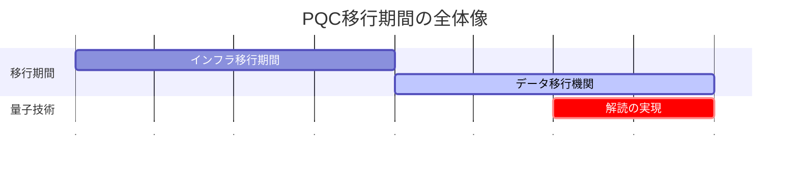

# 第7回　耐量子暗号とこれからの暗号技術

これまでの記事では、RSA暗号や楕円曲線暗号など、現在広く使われている暗号技術について学んできました。これらの暗号は、従来のコンピュータでは解読が困難であることが数学的に証明されており、現在のインターネットセキュリティの基盤となっています。

しかし、近年の量子コンピュータ技術の急速な発展により、これらの暗号技術が将来的に危殆化する可能性が指摘されています。まだ研究段階ではあり、予測の幅は大きいですが、概ね2030年〜2050年ごろには実用的な量子コンピュータが実現されている可能性が示されています。本記事では、量子コンピュータがもたらす脅威と、それに対抗するための耐量子暗号（Post-Quantum Cryptography, PQC）について詳しく解説します。

ただし、ここで紹介する暗号技術のベースとなる理論は、これまで紹介した暗号理論に比べてもやや難解である部分も多くあるため、理論的な詳細は省いて、現在どのような暗号が耐量子暗号として想定されているかの紹介にとどめたいと思います。

耐量子暗号は現在最も活発に研究が進められている暗号技術の最先端分野の一つです。本記事で紹介する情報は執筆時点（2025年）のものであり、新たな攻撃手法の発見やアルゴリズムの安全性評価の更新など、将来的に情報が変更される可能性が十分にあります。実際のシステムへの実装を検討は、最新の研究動向や標準文書を必ずご確認ください。

連載記事の全体は、 [第0回　暗号技術の基礎を学ぶ連載記事一覧](https://qiita.com/naoki_hayashida/items/deafc06c5df43715e334) を参照してください。

# 7.1 量子コンピュータと既存暗号の脅威

## 量子コンピュータとは

量子コンピュータは、量子力学の原理を利用して計算を行う次世代のコンピュータです。従来のコンピュータがビット（0または1）を基本単位として計算するのに対し、量子コンピュータは量子ビット（qubit）を使用し、重ね合わせや量子もつれなどの量子現象を活用します。

## Shorのアルゴリズムによる脅威

1994年にPeter Shorが発表した**Shorのアルゴリズム** は、量子コンピュータ上で素因数分解と離散対数問題を多項式時間で解くことができる画期的なアルゴリズムです。

#### RSA暗号への影響

RSA暗号の安全性は、大きな合成数の素因数分解の困難性に基づいています。現在、2048ビットのRSA鍵を従来のコンピュータで解読するには、数千年から数万年かかるとされています。

しかし、Shorのアルゴリズムを使用する量子コンピュータが実現すれば、2048ビットのRSA鍵は数時間から数日で解読できる可能性があります。

#### 楕円曲線暗号への影響

楕円曲線暗号（ECC）も同様に、楕円曲線上の離散対数問題の困難性に基づいています。Shorのアルゴリズムは楕円曲線上の離散対数問題にも適用できるため、ECDSAやECDHなどの楕円曲線暗号も量子コンピュータによって解読される可能性があります。

## Groverのアルゴリズムによる脅威

**Groverのアルゴリズム** は、非構造化探索問題を従来のコンピュータの平方根の時間で解くことができる量子アルゴリズムです。

#### 対称鍵暗号への影響

AESなどの対称鍵暗号は、Groverのアルゴリズムによって鍵長が実質的に半分になります。例えば、AES-256は量子コンピュータ上では128ビットの安全性しか持たなくなります。
ただし、これは対称鍵暗号の鍵長を2倍にすることで対応可能です（AES-256をAES-512にする）。

## 量子コンピュータの現状

現在、実用的な量子コンピュータはまだ実現していませんが、GoogleやIBMなどの企業が数十から数百量子ビットの量子コンピュータを開発しており、**量子優位性** （特定の問題で従来のコンピュータを上回る性能）の実証も行われています。

専門家の予測では、実用的な量子コンピュータが実現するのは2030年代から2040年代とされていますが、暗号技術の移行には10年から20年の時間がかかるため、今から準備を始める必要があります。


# 7.2 NIST PQC標準化プロジェクト

## 標準化の背景

量子コンピュータの脅威に対抗するため、米国国立標準技術研究所（NIST）は2016年に**Post-Quantum Cryptography（PQC）標準化プロジェクト** を開始しました。このプロジェクトの目的は、量子コンピュータに耐性を持つ暗号アルゴリズムを標準化することです。

## 標準化プロセスの流れ

1. **提案段階** ：世界中の研究者から耐量子暗号アルゴリズムの提案を募集
2. **評価段階** ：数学的安全性、実装効率性、実用性を評価
3. **選定段階** ：最終的な標準アルゴリズムを選定
4. **実装段階** ：標準化されたアルゴリズムの実装と展開

## 標準化の現状

NISTは、2022年7月に選定を発表し、2024年8月に以下を正式標準として発表しました。
- **ML-KEM（FIPS 203、旧CRYSTALS-Kyber）** ：公開鍵暗号・鍵交換の標準として選定
- **ML-DSA（FIPS 204、旧CRYSTALS-Dilithium）** ：ディジタル署名の標準として選定
- **SLH-DSA（FIPS 205、旧SPHINCS+）** ：ハッシュ関数ベース署名の標準として選定

また、以下のアルゴリズムも選定されており、標準化作業が進行中です。
- **FN-DSA（FIPS 206、旧Falcon）** ：ディジタル署名の代替標準（標準化作業中）

また、2025年3月に標準化予定のアルゴリズムとしてHQCが追加されました。
- **HQC** ：符号ベース暗号による鍵カプセル化メカニズム

# 7.3 格子暗号（Lattice-Based Cryptography）

## 格子問題の基礎

**格子（Lattice）** は、数学的に以下のように定義されます。

$L = \{ \sum_{i=1}^{n} x_i \mathbf{b}_i : x_i \in \mathbb{Z} \}$

ここで、$\mathbf{b}_1, \mathbf{b}_2, \ldots, \mathbf{b}_n$は線形独立なベクトル（基底）です。

#### 格子の直感的な理解

格子を理解するために、身近な例を考えてみましょう。

**2次元の格子の例** ：
- 平面上に2つのベクトル $\mathbf{b}_1 = (1, 0)$ と $\mathbf{b}_2 = (0, 1)$ を考えます
- この2つのベクトルを「基底」として、整数倍の組み合わせで作られる点の集合が格子です
- つまり、$(x_1, x_2)$ という点は、$x_1 \mathbf{b}_1 + x_2 \mathbf{b}_2 = (x_1, x_2)$ として表現されます
- これは、座標軸上の整数座標の点（格子点）の集合になります


**3次元の格子の例** ：
- 3つのベクトル $\mathbf{b}_1 = (1, 0, 0)$、$\mathbf{b}_2 = (0, 1, 0)$、$\mathbf{b}_3 = (0, 0, 1)$ を基底とすると
- 3次元空間内の整数座標の点（立方体の格子）ができます

**一般の格子** ：
- 基底ベクトルが必ずしも座標軸に沿っている必要はありません
- 例えば、$\mathbf{b}_1 = (2, 1)$、$\mathbf{b}_2 = (1, 2)$ のような斜めのベクトルでも格子を作れます
- この場合、格子点は斜めに並んだ点の集合になります


格子暗号では、このような格子の数学的性質（特に「最短ベクトル」や「最近ベクトル」を見つけることの困難性）を暗号の安全性の根拠として利用します。

格子暗号の安全性は、以下の問題の困難性に基づいて構築されています。

1. **最短ベクトル問題（SVP）** ：格子内の最短非零ベクトルを見つける
2. **最近ベクトル問題（CVP）** ：与えられた点に最も近い格子点を見つける（SVPより一般的）


## 学習関数問題（LWE）

**Learning With Errors（LWE）** は、格子暗号の最も重要な数学的問題です。

#### LWE問題の定義

$n$次元のベクトル$\mathbf{a} \in \mathbb{Z}_q^n$と、ノイズ$e \in \mathbb{Z}_q$が与えられたとき、以下の方程式を満たす秘密ベクトル$\mathbf{s} \in \mathbb{Z}_q^n$を見つける問題：

$b = \langle \mathbf{a}, \mathbf{s} \rangle + e \pmod{q}$

ここで、$e$は小さなノイズ（通常、$|e| \ll q$）です。

#### LWE問題の直感的な理解

LWE問題を身近な例で理解してみましょう。

**簡単な例（$n=2$の場合）** ：
- 秘密ベクトル：$\mathbf{s} = (3, 7)$（これは秘密にしておく）
- 公開ベクトル：$\mathbf{a} = (2, 5)$
- ノイズ：$e = 1$（小さな値）
- 法：$q = 17$

このとき、$b = \langle \mathbf{a}, \mathbf{s} \rangle + e = (2 \times 3 + 5 \times 7) + 1 = 6 + 35 + 1 = 42 \equiv 8 \pmod{17}$

**攻撃者の視点** ：
- 攻撃者は $\mathbf{a} = (2, 5)$ と $b = 8$ を知っています
- しかし、ノイズ $e = 1$ の存在により、正確な内積値は分かりません
- 攻撃者は $\mathbf{s} = (3, 7)$ を見つけようとしますが、ノイズがあるため困難です

**なぜ困難なのか** ：
1. **ノイズの存在** ：正確な方程式ではなく、ノイズが加わった方程式を解く必要があります
2. **多次元性** ：$n$が大きくなるほど、解の候補が指数的に増加します
3. **格子問題との関連** ：この問題は格子の「CVP（最近ベクトル問題）」に帰着できます


#### LWEの困難性

LWE問題は、格子問題の一種である**最短独立ベクトル問題（SIVP）** に帰着できることが知られており、量子コンピュータでも効率的に解く方法は見つかっていません。

**安全性の根拠** ：
- 現在の最良のアルゴリズムでも、$n$次元のLWE問題を解くには指数時間が必要
- 量子コンピュータのShorのアルゴリズムは、素因数分解や離散対数問題には適用できるが、LWE問題には適用できない
- 格子問題は長年研究されており、数学的に深く理解されている

## Ring-LWE

**Ring-LWE** は、LWEを多項式環上に拡張した問題です。これにより、鍵サイズを大幅に削減できます。

#### Ring-LWE問題の定義

多項式環$R_q = \mathbb{Z}_q[X]/(X^n + 1)$において、$a \in R_q$とノイズ$e \in R_q$が与えられたとき、以下の方程式を満たす秘密多項式$s \in R_q$を見つける問題：

$b = a \cdot s + e \pmod{q}$

#### Ring-LWEの直感的な理解

Ring-LWEを理解するために、多項式の世界での計算を考えてみましょう。

**多項式環とは** ：
- 通常のLWEでは、ベクトル同士の内積を計算していました
- Ring-LWEでは、多項式同士の掛け算を計算します
- 多項式環 $R_q = \mathbb{Z}_q[X]/(X^n + 1)$ は、$X^n \equiv -1 \pmod{q}$ という関係式を持つ多項式の集合です

**具体例（$n=4$の場合）** ：
- 秘密多項式：$s = 2X^3 + 3X^2 + X + 1$
- 公開多項式：$a = X^3 + 2X^2 + 3X + 4$
- ノイズ多項式：$e = X^2 + 1$（係数が小さい）
- 法：$q = 17$

**計算過程** ：
1. $a \cdot s$ を計算：
   - $(X^3 + 2X^2 + 3X + 4) \times (2X^3 + 3X^2 + X + 1)$
   - 展開すると：$2X^6 + 7X^5 + 13X^4 + 20X^3 + 17X^2 + 7X + 4$

2. $X^4 \equiv -1 \pmod{17}$ の関係式を適用：
   - $X^6 = X^4 \cdot X^2 \equiv -X^2 \pmod{17}$
   - $X^5 = X^4 \cdot X \equiv -X \pmod{17}$
   - 整理すると：
    ```math
    -2X^2 - 7X - 13 + 20X^3 + 17X^2 + 7X + 4 = 20X^3 + 15X^2 + 0X - 9
    ```
   - $\pmod{17}$で計算：$20 \equiv 3, -9 \equiv 8$
   - 最終結果：$3X^3 + 15X^2 + 8$

3. ノイズを加算：
   - $b = (3X^3 + 15X^2 + 8) + (X^2 + 1) = 3X^3 + 16X^2 + 9$

**攻撃者の困難性** ：
- 攻撃者は $a$ と $b$ を知っていますが、ノイズ $e$ の存在により正確な $s$ を見つけるのは困難です
- 多項式の掛け算は、ベクトルの内積よりも複雑で、解くのがより困難になります

#### Ring-LWEの利点

**鍵サイズの削減** ：
- 通常のLWE：$n$次元ベクトルを扱うため、鍵サイズは $O(n)$
- Ring-LWE：$n$次元多項式を扱うため、鍵サイズは $O(n)$ だが、構造化されているため効率的に処理可能

**計算効率** ：
- 多項式の掛け算は、高速フーリエ変換（FFT）を使って効率的に計算できます
- これにより、実装が高速になります

**安全性** ：
- Ring-LWEも通常のLWEと同様に、格子問題の困難性に基づいています
- 量子コンピュータでも効率的に解く方法は見つかっていません

## 格子暗号の利点

1. **量子耐性** ：Shorのアルゴリズムでは解読できない
2. **効率性** ：比較的高速な実装が可能
3. **機能性** ：準同型暗号などの高機能暗号との親和性が高い
4. **数学的基盤** ：格子問題は長年研究されており、安全性の理解が進んでいる

## 格子暗号の応用例

### ML-KEM（CRYSTALS-Kyber）

ML-KEM（CRYSTALS-Kyber）は、Ring-LWEに基づく公開鍵暗号・鍵交換アルゴリズムです。

**鍵生成** ：
1. 秘密多項式$s, e \in R_q$をランダムに生成
2. 公開多項式$A \in R_q$をランダムに生成
3. $b = A \cdot s + e \pmod{q}$を計算
4. 公開鍵：$(A, b)$、秘密鍵：$s$

**暗号化** ：
1. メッセージ$m$を多項式に変換
2. ランダム多項式$r, e_1, e_2 \in R_q$を生成
3. $u = A^T \cdot r + e_1 \pmod{q}$
4. $v = b^T \cdot r + e_2 + m \pmod{q}$
5. 暗号文：$(u, v)$

**復号** ：
1. $m' = v - s^T \cdot u \pmod{q}$を計算
2. ノイズ除去処理（Rounding）：計算結果$m'$にはノイズが含まれているため、各係数を適切な値に丸める処理を行う
3. 元のメッセージ$m$を復元

### NTRU暗号
NTRU暗号は、多項式環上での計算に基づく格子暗号で、1996年に提案された初期の格子暗号アルゴリズムの一つです。

**鍵生成**:
1. 秘密多項式$f, g \in R$をランダムに生成(係数は小さな整数)
2. $f$の逆元$f_q \in R_q$を計算
3. 公開鍵$h = p \cdot g \cdot f_q \pmod{q}$を計算
4. 公開鍵:$h$、秘密鍵:$f$

**暗号化**:
1. メッセージ$m$を多項式に変換
2. ランダム多項式$r \in R$を生成
3. 暗号文:$c = p \cdot r \cdot h + m \pmod{q}$

**復号**:
1. $a = f \cdot c \pmod{q}$を計算
2. 係数を適切な範囲に調整
3. $m = a \pmod{p}$により元のメッセージを復元

**特徴**:
- 高速な多項式演算により効率的な実装が可能
- NISTの標準化では選定されなかったものの、長年の研究により安全性が評価されている
- ML-KEMと比較すると鍵サイズがやや大きい傾向にある

# 7.4 多変数多項式暗号（Multivariate Cryptography）

## 多変数多項式問題

**多変数多項式暗号** は、多変数多項式方程式の解を求める困難性（NP困難）に基づく暗号です。

### 多変数二次方程式問題（MQ問題）

$n$個の変数$x_1, x_2, \ldots, x_n$に関する$m$個の二次方程式：

$f_i(x_1, x_2, \ldots, x_n) = 0 \quad (i = 1, 2, \ldots, m)$

この連立方程式の解を見つける問題は、一般にNP困難であることが知られています。

## 多変数暗号の仕組み

### 秘密鍵変換

多変数暗号では、以下の3つの可逆変換を使用します。

1. **線形変換** ：$S: \mathbb{F}^n \rightarrow \mathbb{F}^n$
2. **アフィン変換** ：$T: \mathbb{F}^m \rightarrow \mathbb{F}^m$
3. **中心多項式** ：$F: \mathbb{F}^n \rightarrow \mathbb{F}^m$

### 公開鍵の構成

公開鍵は以下の合成関数で構成されます。

$P = T \circ F \circ S$

### 署名生成

メッセージ$m$の署名を生成するには：

1. $y = T^{-1}(m)$を計算
2. $F(x) = y$の解$x$を見つける
3. $s = S^{-1}(x)$を計算
4. 署名：$s$

### 署名検証

署名$s$の検証：

1. $P(s) = m$を確認

## 多変数暗号の特徴

### 利点
- **量子耐性** ：Groverのアルゴリズムでも効率的に解読できない
- **高速性** ：署名生成・検証が高速
- **小さな鍵サイズ** ：比較的コンパクト

### 欠点
- **大きな公開鍵** ：公開鍵サイズが大きい
- **安全性の評価** ：一部の多変数暗号で解読法が発見されており、信頼性の高い方式の発見の難易度が高い

## 代表的な多変数暗号

### UOV署名

Unbalanced Oil and Vinegar（UOV）署名は、油（Oil）変数と酢（Vinegar）変数を分離した構造を持つ多変数署名方式です。

# 7.5 同種写像暗号（Isogeny-Based Cryptography）

## 楕円曲線の同種写像

**同種写像（Isogeny）** は、楕円曲線間の有理写像で、有限群の準同型写像を誘導するものです。

### 同種写像の定義

楕円曲線$E_1$から$E_2$への同種写像$\phi$は、以下の条件を満たす有理写像です。

1. $\phi(\mathcal{O}\_{E_1}) = \mathcal{O}\_{E_2}$
2. $\phi$は有限群の準同型写像を誘導

## 同種写像問題

**同種写像問題** は、2つの楕円曲線$E_1$と$E_2$が与えられたとき、それらを結ぶ同種写像を見つける問題です。この問題は、量子コンピュータでも効率的に解く方法は見つかっていません。

## SIDH（Supersingular Isogeny Diffie-Hellman）

SIDHは、同種写像問題に基づく鍵交換プロトコルです。

### SIDHの仕組み

1. **パラメータ設定** ：
   - 超特異楕円曲線$E_0$を選択
   - 位数$2^a$と$3^b$の点$P_A, Q_A, P_B, Q_B$を選択

2. **Aliceの鍵生成** ：
   - ランダムな同種写像$\phi_A: E_0 \rightarrow E_A$を生成
   - 公開鍵：$(E_A, \phi_A(P_B), \phi_A(Q_B))$

3. **Bobの鍵生成** ：
   - ランダムな同種写像$\phi_B: E_0 \rightarrow E_B$を生成
   - 公開鍵：$(E_B, \phi_B(P_A), \phi_B(Q_A))$

4. **共通鍵の生成** ：
   - Alice：$E_{AB} = E_B / \langle \phi_B(P_A), \phi_B(Q_A) \rangle$
   - Bob：$E_{AB} = E_A / \langle \phi_A(P_B), \phi_A(Q_B) \rangle$
   - 共通鍵：$E_{AB}$の$j$不変量

## 同種写像暗号の特徴と最新の安全性評価

### かつての利点（2022年以前）
- **小さな鍵サイズ** ：RSAや格子暗号と比較して鍵サイズが小さい
- **量子耐性** ：Shorのアルゴリズムでは解読できない
- **効率性** ：比較的高速な実装が可能

### 2022年の重大な発見：Castryck-Decru攻撃

2022年7月から8月にかけて、Wouter CastryckとThomas Decruは、SIDHおよびSIKE（Supersingular Isogeny Key Encapsulation）に対する **実用的な攻撃法** を発表しました。この攻撃は暗号学界に衝撃を与えました。

**攻撃の特徴** ：
- **古典コンピュータで実行可能** ：量子コンピュータは不要
- **実用的な時間** ：NISTのPQC候補であったSIKEp434が、単一コアのPCで約1時間で解読
- **補助点の悪用** ：SIDHプロトコルで公開される「補助点」情報を巧妙に利用

**攻撃の原理** ：
攻撃者は公開情報に含まれる補助点を利用し、楕円曲線をより高次元の数学的対象（アーベル多様体）に「接着」して解析することで、秘密鍵の計算につながる情報を効率的に抽出することに成功しました。

### 現在の状況
- **SIKEの標準化中止** ：NISTのPQC標準化候補から除外
- **SIDH系暗号の実用性喪失** ：補助点を使用するSIDH系暗号は安全ではないと判明
- **他の同種写像暗号への影響** ：CSIDHやSQISignなど、補助点を使用しない方式は直接的な影響を受けていない

### 現在の欠点
- **実装の複雑性** ：同種写像の計算が複雑
- **安全性の崩壊** ：2022年の攻撃により、SIDH/SIKEは実用的でない

# 7.6 符号ベース暗号（Code-Based Cryptography）

符号ベース暗号は誤り訂正符号をもとにしているため、まずは誤り訂正符号について簡単に説明したうえで、符号ベース暗号についての概略を説明します。

## 誤り訂正符号の基礎

**誤り訂正符号** は、データ伝送時の誤りを検出・訂正するための符号化技術です。

たとえば、AliceがBobに対して、3ビットの値を送信するとします。


しかし何らかの理由で一部が誤った値をBobが受信する可能性があります。


これに対し、単純な誤り訂正符号では、多数決をもって対処します。


これまで3ビットの値は3ビットのまま送信していましたが、1ビットごとに3ビットまで増やして値を送信します。こうすると、3ビットのうち1ビットまでであれば、誤った値となっても「多数決」を取ることで正しい値に戻すことができます。

### 線形符号

線形符号は誤り訂正符号の一種で、以降で説明する符号ベース暗号であるMcEliece暗号で利用されています。

$n$次元ベクトル空間$\mathbb{F}_2^n$の$k$次元部分空間$C$を線形符号と呼びます。$C$は $k\times n$の生成行列$G \in \mathbb{F}_2^{k \times n}$によって：

```math
\begin{align}
C = \{ \mathbf{m}G : \mathbf{m} \in \mathbb{F}_2^k \}
\end{align}
```

と表現されます。

### シンドローム復号

受信したベクトル$\mathbf{y}$から元の符号語$\mathbf{c}$を復元するには、パリティ検査行列$H$を使用してシンドローム$\mathbf{s} = \mathbf{y}H^T$を計算し、誤りパターンを特定します。

## McEliece暗号

**McEliece暗号** は、誤り訂正符号の難問に基づく公開鍵暗号です。

### 鍵生成

1. Goppa符号（線形符号の一種）の生成行列$G$を選択
2. ランダムな可逆行列$S \in \mathbb{F}_2^{k \times k}$を生成
3. ランダムな置換行列$P \in \mathbb{F}_2^{n \times n}$を生成
4. 公開鍵：$G' = SGP$
5. 秘密鍵：$(S, G, P)$

### 暗号化

メッセージ$\mathbf{m} \in \mathbb{F}_2^k$の暗号化：

1. $\mathbf{c} = \mathbf{m}G'$を計算
2. ランダムな誤りベクトル$\mathbf{e} \in \mathbb{F}_2^n$（重み$t$）を生成
3. 暗号文：$\mathbf{y} = \mathbf{c} + \mathbf{e}$

### 復号

暗号文$\mathbf{y}$の復号：

1. $\mathbf{y}' = \mathbf{y}P^{-1}$を計算
2. Goppa符号の復号アルゴリズムで$\mathbf{c}'$を復元
3. $\mathbf{m}' = \mathbf{c}'G^{-1}$を計算
4. $\mathbf{m} = \mathbf{m}'S^{-1}$を計算

## 符号ベース暗号の特徴

### 利点
- **高い安全性** ：40年以上にわたって解読されていない
- **量子耐性** ：線形符号が不十分な情報では複号できず、NP困難に相当。量子コンピュータでも効率的に解読できない
- **数学的基盤** ：誤り訂正符号理論は成熟している

### 欠点
- **大きな鍵サイズ** ：公開鍵サイズが非常に大きい（数MB）
- **効率性** ：暗号化・復号が比較的遅い

## 現代的な符号ベース暗号

### Classic McEliece

Classic McElieceは、元のMcEliece暗号を改良したもので、より効率的な実装と標準化への適合性を向上させています。ただし、公開鍵が非常に大きくなるなどの欠点があり、標準化等には至っていません。

### HQC（Hamming Quasi-Cyclic）

HQCは、準巡回符号を使用して鍵サイズを削減した符号ベース暗号です。

# 7.7 ハッシュベース署名（Hash-Based Signatures）

## ハッシュベース署名の原理

**ハッシュベース署名** は、暗号学的ハッシュ関数のみを使用して構成される署名方式です。その安全性は、ハッシュ関数の衝突耐性と原像困難性に基づいています。

## ワンタイム署名（OTS）

**ワンタイム署名** は、各秘密鍵を一度だけ使用する署名方式です。同じ秘密鍵を複数回使うことができない方式です。

### Lamport署名

Lamport署名は、最も基本的なワンタイム署名方式です。

**鍵生成** ：
1. ランダムなビット列$sk_0, sk_1$を生成
2. $pk_0 = H(sk_0), pk_1 = H(sk_1)$を計算
3. 公開鍵：$(pk_0, pk_1)$、秘密鍵：$(sk_0, sk_1)$

**署名生成** ：
メッセージ$m$の各ビット$m_i$に対して：
- $m_i = 0$の場合：$\sigma_i = sk_0$
- $m_i = 1$の場合：$\sigma_i = sk_1$

**署名検証** ：
各ビット$m_i$に対して：
- $H(\sigma_i) = pk_{m_i}$を確認

### Winternitz署名

Winternitz署名は、Lamport署名を改良して、より効率的なワンタイム署名方式です。

## 多用途署名

ワンタイム署名と異なり、秘密鍵を複数回利用できます。ただし、紹介するどの方式でも、

### Merkle署名

Merkle署名は、複数のワンタイム署名を組み合わせて多用途署名を実現します。

**鍵生成** ：
1. $2^h$個のワンタイム署名鍵ペアを生成
2. Merkle木を構築してルートハッシュを公開鍵とする

**署名生成** ：
1. 未使用のワンタイム署名鍵を選択
2. ワンタイム署名を生成
3. Merkle木の認証パスを追加

**署名検証** ：
1. ワンタイム署名を検証
2. Merkle木の認証パスを検証

### XMSS（eXtended Merkle Signature Scheme）

XMSSは、Merkle署名を改良した標準化されたハッシュベース署名方式です。

### LMS（Leighton-Micali Signature）

LMSは、Merkle署名の別の実装で、RFC 8554で標準化されています。

### SLH-DSA（SPHINCS+）

NISTの標準化で、2022年7月に選定されたアルゴリズムの一つで、唯一格子に基づかないアルゴリズムです。
他のハッシュベース署名と違い、秘密鍵の複数回の利用とステートレスなアルゴリズムとなっています。

## ハッシュベース署名の特徴

### 利点
- **高い安全性** ：ハッシュ関数の安全性のみに依存
- **量子耐性** ：量子コンピュータでも解読できない
- **実装の簡単さ** ：複雑な数学的構造が不要
- **標準化** ：XMSSやLMSが標準化されている

### 欠点
- **大きな署名サイズ** ：署名サイズが大きい
- **状態管理** ：署名鍵の状態管理が必要
- **効率性** ：比較的遅い署名生成・検証

# 7.8 耐量子暗号への移行の課題

ここからは、個別の技術ではなく、耐量子暗号へどのように移行していく必要があるのか、そして移行期におけるセキュリティについて見ていきます。

## CRYPTREC暗号技術ガイドライン（耐量子計算機暗号）2024年度版

2025年3月に公開された「CRYPTREC暗号技術ガイドライン（耐量子計算機暗号）2024年度版」は、日本における耐量子暗号の移行指針を示す重要な文書です。このガイドラインでは、耐量子暗号への移行期間の必要性と、それに伴う様々な課題について詳しく解説されています。

[CRYPTREC | 暗号技術ガイドライン](https://www.cryptrec.go.jp/tech_guidelines.html)

## 移行期間が必要な理由

### 技術的な準備期間

PQCアルゴリズムへの移行は、単純な暗号アルゴリズムの置き換えではありません。以下の理由から、10年から20年という長期間の移行期間が必要とされています：

1. **実装の複雑性** ：PQCアルゴリズムは従来の暗号と比べて実装が複雑で、十分なテストと検証が必要となる
2. **標準化の進行** ：NISTの標準化プロジェクトは継続中で、完全な標準化や実用的なライブラリの実現までには時間がかかる
3. **相互運用性の確保** ：異なるシステム間での互換性を保証する必要がある
4. **性能最適化** ：PQC自体は既存の暗号技術よりも一般的にパフォーマンスが出にくく、実用的な性能を実現するための最適化作業が必要となる

### 段階的移行の必要性

CRYPTRECガイドラインでは、以下の段階的な移行アプローチが推奨されています：

1. **準備段階** ：PQCアルゴリズムの評価と選択
2. **実験段階** ：限定的な環境での実装とテスト
3. **並行運用段階** ：従来暗号とPQCの併用（ハイブリッド方式）
4. **完全移行段階** ：PQCアルゴリズムのみの運用

### 耐量子暗号への移行期間の全体像

耐量子暗号への移行は、インフラ移行期間とデータ移行期間の両方にまたがる長期的なプロセスです。以下の図は、移行期間全体の構造を示しています（Michele Mosca. 2015. Cybersecurity in a Quantum World: will we be ready? より）。



移行に関しては、解読が実現する前にインフラの移行とデータの移行の両方を実現する必要があります。この要素には、量子技術による実用的な暗号解読がいつ実現されるかということと、インフラおよびデータの移行がいつまでかかるかということがあります。前者は予測不可能である点から、この移行作業はできる限り早く計画、実施していく必要があります。また、データは比較的長期にわたり保存・利用される傾向にあり、セキュリティ脅威に対する軽減策などの計画、実施が必要となる場合もあります。

## ハーベスト攻撃の脅威

**ハーベスト攻撃**（収穫攻撃）は、量子コンピュータが実現する前に攻撃者が大量の暗号文を収集・保存しておき、将来量子コンピュータが実現した時点で一括解読する攻撃手法です。この攻撃は「今すぐ解読する必要がない」という特徴があり、長期間にわたって暗号文を蓄積しておき、後から解読することが可能です。

攻撃者は通信の傍受、データベース侵入、クラウドストレージからの窃取などにより暗号文を収集し、数十年にわたって保存します。量子コンピュータが実現した時点で、蓄積した暗号文を一括解読し、過去の機密情報を復元します。

この攻撃の存在により、PQCへの移行は緊急性を帯びています。一度収集された暗号文は回収不可能であり、現在進行中の通信も将来解読される可能性があるため、早期の移行準備が重要です。

## 今後の展望

CRYPTRECガイドラインでは、2030年代から2040年代にかけて、実用的な量子コンピュータが実現される可能性が高いと予測されています。そのため、現在から移行準備を開始することが重要です。

# 7.9 実世界の動向

## 耐量子暗号の各社の導入

### Google

Googleは2016年から、TLS 1.3にPQCアルゴリズム（ML-KEM）を組み込んだ実験を開始しました。ChromeブラウザとGoogleサーバ間で、従来の楕円曲線暗号とPQCアルゴリズムを併用する**ハイブリッド鍵交換** を実装しています。2024年5月には、PC向けのChromeブラウザで、TLS 1.3とQUIC用のML-KEMをデフォルトで有効化しています。

https://developers-jp.googleblog.com/2024/09/post-quantum-cryptography-standards.html

また、OpenSSLをフォークした、BoringSSLにて、ML-KEM768（Kyber-768）を実装し、Chromeブラウザ等で利用しています。

https://security.googleblog.com/2024/09/a-new-path-for-kyber-on-web.html

### Apple

メッセージングアプリの iMessage に耐量子暗号プロトコルであるPQ3を導入しています。

https://security.apple.com/blog/imessage-pq3/

### Cloudflareの実験

Cloudflareも同様に、PQCアルゴリズムをTLSに統合する実験を行っています。これにより、量子コンピュータが実現した場合でも、過去の通信が解読されないことを保証します。

https://developers.cloudflare.com/ssl/post-quantum-cryptography/

### AWS

AWSもPQCの導入に関して、2024年に移行計画を発表しています。

https://aws.amazon.com/jp/blogs/news/aws-post-quantum-cryptography-migration-plan/

また、AWS Key Management Service（KMS）、AWS Certificate Manager（ACM）、AWS Secrets Manager でPQCハイブリット鍵交換をサポートしています。

https://aws.amazon.com/jp/blogs/security/ml-kem-post-quantum-tls-now-supported-in-aws-kms-acm-and-secrets-manager/

### Microsoft

Microsoftは、Microsoft Quantum Safe Programとして、2033年までのPQC完全移行を目指しています。また、2024年にはWindows 11のInsider Preview版でPQC機能の公開をしました。Azure、Windows、Officeの暗号基盤であるSymCryptライブラリに、NIST標準アルゴリズム（ML-KEM, ML-DSA）を統合中です。

https://news.microsoft.com/ja-jp/2025/08/22/quantum-safe-security-progress-towards-next-generation-cryptography/

### Meta（Facebook）

2024年5月にブログでPQC移行への取り組みを公開しています。社内サービス間の通信（TLS）をKyberを用いたハイブリット暗号で実装、それを導入しています。

https://engineering.fb.com/2024/05/22/security/post-quantum-readiness-tls-pqr-meta/

## OSSの対応

### OpenSSL

バージョン3.2移行で実験的にサポートを開始しています。OQSプロジェクトが提供するプロバイダを介して、PQCアルゴリズムを利用可能です。

https://openssl-library.org/news/openssl-3.2-notes/

https://github.com/open-quantum-safe/oqs-provider

## 電子署名への応用

### 政府・金融機関での導入

各国の政府や金融機関は、長期的なデータ保護のためにPQCアルゴリズムの導入を検討しています。特に、機密性が長期間必要となるデータ（医療記録、法的文書など）の保護に重要です。また、医療機器などは利用期間が非常に長く、より早期での対応が求められることになります。

## 暗号資産への応用

### ビットコイン・イーサリアム

主要な暗号資産プロジェクトは、PQCアルゴリズムへの移行を検討しています。特に、長期的な価値保存を目的とする暗号資産では、量子耐性が重要です。

https://bip360.org/

https://thequantuminsider.com/2025/10/16/btq-technologies-announces-quantum-safe-bitcoin-using-nist-standardized-post-quantum-cryptography/

https://ethereum.org/ja/roadmap/future-proofing/

### 新しい暗号資産

一部のプロジェクト（QRL、Algorandなど）では、最初からPQCアルゴリズムを使用した暗号資産を開発しています。

https://www.theqrl.org/

https://algorand.co/

## 実装の課題

### 性能オーバーヘッド

PQCアルゴリズムは、従来の暗号と比較して計算コストが高い場合があります。特に、モバイルデバイスやIoT機器での実装には注意が必要です。

### 鍵サイズの増大

多くのPQCアルゴリズムは、従来の暗号と比較して鍵サイズや署名サイズが大きくなります。これにより、ネットワーク帯域やストレージ容量への影響を考慮する必要があります。

### 標準化の遅れ

PQCアルゴリズムの標準化は一部完了していますが、多様性を持たせるための複数の理論的基盤を基にしたアルゴリズムの完全な標準化までにはまだ時間がかかります。また、標準化されたアルゴリズムでも、長期的な安全性の評価は継続的に行う必要があります。

# 7.10 まとめと今後の展望

## 本記事の要点

本記事では、量子コンピュータがもたらす暗号技術への脅威と、それに対抗するための耐量子暗号について詳しく解説しました。

### 主要な脅威
- **Shorのアルゴリズム** ：RSA暗号や楕円曲線暗号を解読
- **Groverのアルゴリズム** ：対称鍵暗号の安全性を半減

### 耐量子暗号の種類
1. **格子暗号** ：LWE問題に基づく、効率的で高機能
2. **多変数多項式暗号** ：MQ問題に基づく、高速な署名
3. **同種写像暗号** ：小さな鍵サイズ、楕円曲線ベース
4. **符号ベース暗号** ：高い安全性、大きな鍵サイズ
5. **ハッシュベース署名** ：高い安全性、大きな署名サイズ

## 今後の暗号技術

### 標準化の進展

NISTのPQC標準化プロジェクトの完了により、業界標準としてのPQCアルゴリズムが確立され、実装と展開が加速されることが期待されます。

### 各ITサービスの導入計画や実現

一部サービスやアプリケーションにおいては、すでに実験的なPQCの導入がスタートしており、これは徐々に多くのサービスやアプリケーションへと広がっていくことが想定されます。

### 開発者への影響

暗号技術を使用する開発者は、以下の点を考慮する必要があります。

- PQCアルゴリズムの特性理解
- 性能要件の見直し
- 鍵管理システムの更新
- セキュリティプロトコルの改訂
- PQCをサポートする利用ツールやライブラリへの移行、アップデート
- インフラやデータの移行計画の策定、実施

## 全体のまとめ

本連載では、暗号技術の基礎から最新の高機能暗号、そして耐量子暗号まで、包括的に解説しました。

### 学んだ内容
1. **暗号技術の基礎** ：各暗号技術の概要、安全性モデル、計算量的困難性
2. **共通鍵暗号** ：ブロック暗号、ストリーム暗号、DES、AES、暗号モード
3. **ハッシュ関数とMAC** ：ハッシュ関数、完全性、認証の仕組み
4. **公開鍵暗号** ：Diffie-Hellman鍵共有、RSA暗号、楕円曲線暗号
5. **高機能暗号** ：IDベース暗号、属性ベース暗号、検索可能暗号、匿名署名
6. **耐量子暗号** ：量子計算機による脅威への対応

#### 実世界との関連
各記事で取り上げた暗号技術は、TLS、VPN、暗号資産、電子署名など、現代のディジタル社会を支える重要な技術として実際に使用されています。

## 今後の学習に向けて

暗号技術は急速に発展している分野です。本連載で学んだ基礎知識以外にも、以下のような分野の暗号に関連する技術が発展しています。

- **量子暗号** ：量子力学を利用した暗号技術
- **マルチパーティ計算** ：プライバシー保護型の分散計算
- **ゼロ知識証明** ：情報を開示せずに証明を行う技術
- **ブロックチェーン暗号** ：分散システムにおける暗号技術
