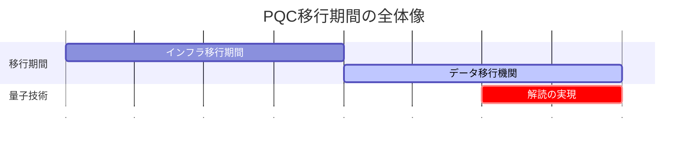

# 第7回　耐量子暗号とこれからの暗号技術

これまでの記事では、RSA暗号や楕円曲線暗号など、現在広く使われている暗号技術について学んできました。これらの暗号は、従来のコンピュータでは解読が困難であることが数学的に証明されており、現在のインターネットセキュリティの基盤となっています。

しかし、近年の量子コンピュータ技術の急速な発展により、これらの暗号技術が将来的に危殆化する可能性が指摘されています。まだ研究段階ではあり、予測の幅は大きいですが、概ね2030年〜2050年ごろには実用的な量子コンピュータが実現されている可能性が示されています。本記事では、量子コンピュータがもたらす脅威と、それに対抗するための耐量子暗号（Post-Quantum Cryptography, PQC）について詳しく解説します。

ただし、ここで紹介する暗号技術のベースとなる理論は、これまで紹介した暗号理論に比べてもやや難解である部分も多くあるため、理論的な詳細は省いて、現在どのような暗号が耐量子暗号として想定されているかの紹介にとどめたいと思います。

耐量子暗号は現在最も活発に研究が進められている暗号技術の最先端分野の一つです。本記事で紹介する情報は執筆時点（2025年）のものであり、新たな攻撃手法の発見やアルゴリズムの安全性評価の更新など、将来的に情報が変更される可能性が十分にあります。実際のシステムへの実装を検討は、最新の研究動向や標準文書を必ずご確認ください。

連載記事の全体は、 [第0回　暗号技術の基礎を学ぶ連載記事一覧](https://qiita.com/naoki_hayashida/items/deafc06c5df43715e334) を参照してください。

# 7.1 量子コンピュータと既存暗号の脅威

## 量子コンピュータとは

量子コンピュータは、量子力学の原理を利用して計算を行う次世代のコンピュータです。従来のコンピュータがビット（0または1）を基本単位として計算するのに対し、量子コンピュータは量子ビット（qubit）を使用し、重ね合わせや量子もつれなどの量子現象を活用します。

## Shorのアルゴリズムによる脅威

1994年にPeter Shorが発表した**Shorのアルゴリズム** は、量子コンピュータ上で素因数分解と離散対数問題を多項式時間で解くことができる画期的なアルゴリズムです。

#### RSA暗号への影響

RSA暗号の安全性は、大きな合成数の素因数分解の困難性に基づいています。現在、2048ビットのRSA鍵を従来のコンピュータで解読するには、数千年から数万年かかるとされています。

しかし、Shorのアルゴリズムを使用する量子コンピュータが実現すれば、2048ビットのRSA鍵は数時間から数日で解読できる可能性があります。

#### 楕円曲線暗号への影響

楕円曲線暗号（ECC）も同様に、楕円曲線上の離散対数問題の困難性に基づいています。Shorのアルゴリズムは楕円曲線上の離散対数問題にも適用できるため、ECDSAやECDHなどの楕円曲線暗号も量子コンピュータによって解読される可能性があります。

## Groverのアルゴリズムによる脅威

**Groverのアルゴリズム** は、非構造化探索問題を従来のコンピュータの平方根の時間で解くことができる量子アルゴリズムです。

#### 対称鍵暗号への影響

AESなどの対称鍵暗号は、Groverのアルゴリズムによって鍵長が実質的に半分になります。例えば、AES-256は量子コンピュータ上では128ビットの安全性しか持たなくなります。
ただし、これは対称鍵暗号の鍵長を2倍にすることで対応可能です（AES-256をAES-512にする）。

## 量子コンピュータの現状

現在、実用的な量子コンピュータはまだ実現していませんが、GoogleやIBMなどの企業が数十から数百量子ビットの量子コンピュータを開発しており、**量子優位性** （特定の問題で従来のコンピュータを上回る性能）の実証も行われています。

専門家の予測では、実用的な量子コンピュータが実現するのは2030年代から2040年代とされていますが、暗号技術の移行には10年から20年の時間がかかるため、今から準備を始める必要があります。


# 7.2 NIST PQC標準化プロジェクト

## 標準化の背景

量子コンピュータの脅威に対抗するため、米国国立標準技術研究所（NIST）は2016年に**Post-Quantum Cryptography（PQC）標準化プロジェクト** を開始しました。このプロジェクトの目的は、量子コンピュータに耐性を持つ暗号アルゴリズムを標準化することです。

## 標準化プロセスの流れ

1. **提案段階** ：世界中の研究者から耐量子暗号アルゴリズムの提案を募集
2. **評価段階** ：数学的安全性、実装効率性、実用性を評価
3. **選定段階** ：最終的な標準アルゴリズムを選定
4. **実装段階** ：標準化されたアルゴリズムの実装と展開

## 標準化の現状

NISTは、2022年7月に選定を発表し、2024年8月に以下を正式標準として発表しました。
- **ML-KEM（FIPS 203、旧CRYSTALS-Kyber）** ：公開鍵暗号・鍵交換の標準として選定
- **ML-DSA（FIPS 204、旧CRYSTALS-Dilithium）** ：ディジタル署名の標準として選定
- **SLH-DSA（FIPS 205、旧SPHINCS+）** ：ハッシュ関数ベース署名の標準として選定

また、以下のアルゴリズムも選定されており、標準化作業が進行中です。
- **FN-DSA（FIPS 206、旧Falcon）** ：ディジタル署名の代替標準（標準化作業中）

また、2025年3月にHQCが標準化されることが決定しました。
- **HQC** ：符号ベース暗号による鍵カプセル化メカニズム

# 7.3 格子暗号（Lattice-Based Cryptography）

## 格子問題の基礎

**格子（Lattice）** は、数学的に以下のように定義されます。

$L = \{ \sum_{i=1}^{n} x_i \mathbf{b}_i : x_i \in \mathbb{Z} \}$

ここで、$\mathbf{b}_1, \mathbf{b}_2, \ldots, \mathbf{b}_n$は線形独立なベクトル（基底）です。

#### 格子の直感的な理解

格子を理解するために、身近な例を考えてみましょう。

**2次元の格子の例** ：
- 平面上に2つのベクトル $\mathbf{b}_1 = (1, 0)$ と $\mathbf{b}_2 = (0, 1)$ を考えます
- この2つのベクトルを「基底」として、整数倍の組み合わせで作られる点の集合が格子です
- つまり、$(x_1, x_2)$ という点は、$x_1 \mathbf{b}_1 + x_2 \mathbf{b}_2 = (x_1, x_2)$ として表現されます
- これは、座標軸上の整数座標の点（格子点）の集合になります


**3次元の格子の例** ：
- 3つのベクトル $\mathbf{b}_1 = (1, 0, 0)$、$\mathbf{b}_2 = (0, 1, 0)$、$\mathbf{b}_3 = (0, 0, 1)$ を基底とすると
- 3次元空間内の整数座標の点（立方体の格子）ができます

**一般の格子** ：
- 基底ベクトルが必ずしも座標軸に沿っている必要はありません
- 例えば、$\mathbf{b}_1 = (2, 1)$、$\mathbf{b}_2 = (1, 2)$ のような斜めのベクトルでも格子を作れます
- この場合、格子点は斜めに並んだ点の集合になります


格子暗号では、このような格子の数学的性質（特に「最短ベクトル」や「最近ベクトル」を見つけることの困難性）を暗号の安全性の根拠として利用します。

格子暗号の安全性は、以下の問題の困難性に基づいて構築されています。

1. **最短ベクトル問題（SVP）** ：格子内の最短非零ベクトルを見つける
2. **最近ベクトル問題（CVP）** ：与えられた点に最も近い格子点を見つける（SVPより一般的）


## 学習関数問題（LWE）

**Learning With Errors（LWE）** は、格子暗号の最も重要な数学的問題です。

#### LWE問題の定義

$n$次元のベクトル$\mathbf{a} \in \mathbb{Z}_q^n$と、ノイズ$e \in \mathbb{Z}_q$が与えられたとき、以下の方程式を満たす秘密ベクトル$\mathbf{s} \in \mathbb{Z}_q^n$を見つける問題：

$b = \langle \mathbf{a}, \mathbf{s} \rangle + e \pmod{q}$

ここで、$e$は小さなノイズ（通常、$|e| \ll q$）です。

#### LWE問題の直感的な理解

LWE問題を身近な例で理解してみましょう。

**簡単な例（$n=2$の場合）** ：
- 秘密ベクトル：$\mathbf{s} = (3, 7)$（これは秘密にしておく）
- 公開ベクトル：$\mathbf{a} = (2, 5)$
- ノイズ：$e = 1$（小さな値）
- 法：$q = 17$

このとき、$b = \langle \mathbf{a}, \mathbf{s} \rangle + e = (2 \times 3 + 5 \times 7) + 1 = 6 + 35 + 1 = 42 \equiv 8 \pmod{17}$

**攻撃者の視点** ：
- 攻撃者は $\mathbf{a} = (2, 5)$ と $b = 8$ を知っています
- しかし、ノイズ $e = 1$ の存在により、正確な内積値は分かりません
- 攻撃者は $\mathbf{s} = (3, 7)$ を見つけようとしますが、ノイズがあるため困難です

**なぜ困難なのか** ：
1. **ノイズの存在** ：正確な方程式ではなく、ノイズが加わった方程式を解く必要があります
2. **多次元性** ：$n$が大きくなるほど、解の候補が指数的に増加します
3. **格子問題との関連** ：この問題は格子の「CVP（最近ベクトル問題）」に帰着できます


#### LWEの困難性

LWE問題は、格子問題の一種である**最短独立ベクトル問題（SIVP）** に帰着できることが知られており、量子コンピュータでも効率的に解く方法は見つかっていません。

**安全性の根拠** ：
- 現在の最良のアルゴリズムでも、$n$次元のLWE問題を解くには指数時間が必要
- 量子コンピュータのShorのアルゴリズムは、素因数分解や離散対数問題には適用できるが、LWE問題には適用できない
- 格子問題は長年研究されており、数学的に深く理解されている

## Ring-LWE

**Ring-LWE** は、LWEを多項式環上に拡張した問題です。これにより、鍵サイズを大幅に削減できます。

### Ring-LWE問題の定義

多項式環$R_q = \mathbb{Z}_q[X]/(X^n + 1)$において、$a \in R_q$とノイズ$e \in R_q$が与えられたとき、以下の方程式を満たす秘密多項式$s \in R_q$を見つける問題：

$b = a \cdot s + e \pmod{q}$

ここで、$a$は公開多項式、$s$は秘密多項式、$e$は小さい係数を持つノイズ多項式です。

### Ring-LWEの直感的な理解

**通常のLWEとの違い**：
- **通常のLWE**：$n$次元のベクトル同士の内積を計算します
- **Ring-LWE**：$n-1$次以下の多項式同士の掛け算を計算します

**多項式環の役割**：
多項式環 $R_q = \mathbb{Z}_q[X]/(X^n + 1)$ は、$X^n \equiv -1 \pmod{q}$ という関係式を持ちます。この関係式により、高次の項（$X^n$以上）が低次の項に折り返されるため、多項式の次数は常に$n-1$次以下に保たれます。

**攻撃者の困難性**：
攻撃者は公開多項式$a$と$b$を知っていますが、ノイズ$e$の存在により秘密多項式$s$を見つけることは困難です。この問題も格子問題の一種であり、量子コンピュータでも効率的に解く方法は見つかっていません。

### Ring-LWEの利点

**鍵サイズの大幅な削減**：
- **通常のLWE**：公開鍵として$n$次元ベクトルを$m$個保持する必要があり、鍵サイズは$O(n^2)$
- **Ring-LWE**：公開鍵として1つの多項式（$n$個の係数）で表現でき、鍵サイズは$O(n)$
- これにより、鍵サイズが劇的に削減されます（例：$n=256$なら理論上256倍の削減）

**計算効率**：
多項式の掛け算は、数論変換（NTT: Number Theoretic Transform）を使って$O(n \log n)$時間で効率的に計算できます。これにより、実装が高速になります。

**安全性**：
Ring-LWEも通常のLWEと同様に、格子問題の困難性に基づいています。ただし、多項式環の構造を利用するため、通常のLWEよりもやや弱い安全性保証となる可能性が理論的に指摘されています。

### Module-LWE

**Module-LWE** は、Ring-LWEをさらに拡張したもので、複数の多項式をベクトルとして扱います。Ring-LWEとベクトルLWEの中間的な性質を持ちます。

- **Ring-LWE**：多項式1つ（鍵サイズ最小、安全性パラメータの柔軟性が低い）
- **Module-LWE**：多項式のベクトル（鍵サイズと安全性のバランスが良い）
- **通常のLWE**：完全なベクトル（鍵サイズ最大、安全性パラメータの柔軟性が高い）

ML-KEMなどの現代的な格子暗号は、このバランスの良いModule-LWEを採用しています。

## 格子暗号の利点

1. **量子耐性** ：Shorのアルゴリズムでは解読できない
2. **効率性** ：比較的高速な実装が可能
3. **機能性** ：準同型暗号などの高機能暗号との親和性が高い
4. **数学的基盤** ：格子問題は長年研究されており、安全性の理解が進んでいる

## 格子暗号の応用例

### ML-KEM（CRYSTALS-Kyber）

ML-KEM（CRYSTALS-Kyber）は、Module-LWE問題に基づく**鍵カプセル化メカニズム（Key Encapsulation Mechanism, KEM）**です。KEMは、メッセージを直接暗号化するのではなく、送信者と受信者の間で**共有秘密鍵を安全に確立**するための仕組みです。この共有秘密鍵を使って、AESなどの共通鍵暗号でデータを暗号化します。

ML-KEMは、NISTのPQC標準化プロジェクトで最初に選定されたアルゴリズムの一つで、TLS通信や鍵交換プロトコルでの利用が想定されています。

**アルゴリズムの構成** ：

ML-KEMは、Module-LWE問題（Ring-LWEを行列・ベクトルに拡張したもの）に基づいており、セキュリティレベルに応じて3つのパラメータセットがあります：
- **ML-KEM-512** ：AES-128相当のセキュリティ
- **ML-KEM-768** ：AES-192相当のセキュリティ
- **ML-KEM-1024** ：AES-256相当のセキュリティ

**鍵生成（KeyGen）** ：
1. ランダムシード$\rho, \sigma$を生成
2. $\rho$から公開行列$\mathbf{A} \in R_q^{k \times k}$を決定論的に生成（$k$はパラメータセットにより2, 3, 4）
3. $\sigma$から秘密ベクトル$\mathbf{s} \in R_q^k$とエラーベクトル$\mathbf{e} \in R_q^k$を生成（係数は小さい値）
4. $\mathbf{t} = \mathbf{A}\mathbf{s} + \mathbf{e} \pmod{q}$を計算
5. 公開鍵：$(\mathbf{t}, \rho)$、秘密鍵：$\mathbf{s}$

**カプセル化（Encaps）** ：
送信者が受信者の公開鍵を使って共有秘密鍵を生成する処理です。
1. ランダムな値$m \in \{0,1\}^{256}$を生成
2. ハッシュ関数を使って、共有秘密鍵$K$と暗号化用のランダム値$r$を導出
3. $r$から$\mathbf{r}, \mathbf{e_1}, e_2 \in R_q$を生成
4. $\mathbf{u} = \mathbf{A}^T\mathbf{r} + \mathbf{e_1} \pmod{q}$を計算
5. $v = \mathbf{t}^T\mathbf{r} + e_2 + \text{Encode}(m) \pmod{q}$を計算
6. 暗号文$c = (\mathbf{u}, v)$と共有秘密鍵$K$を出力

**脱カプセル化（Decaps）** ：
受信者が自分の秘密鍵を使って、暗号文から共有秘密鍵を復元する処理です。
1. $m' = \text{Decode}(v - \mathbf{s}^T\mathbf{u} \pmod{q})$により$m$を復元
2. ハッシュ関数を使って$m'$から共有秘密鍵$K'$を導出
3. $m'$を使って暗号文を再計算し、受信した暗号文と一致することを確認（Fujisaki-Okamoto変換による安全性強化）
4. 一致すれば$K'$を、一致しなければ失敗値を出力

**特徴** ：
- **効率性** ：格子暗号の中でも実装が高速で、TLS通信などリアルタイム性が求められる用途に適しています
- **鍵サイズ** ：公開鍵は約800バイト〜1.6KB、暗号文は約768バイト〜1.6KBと、RSA暗号と比較してやや大きいですが実用的なサイズです
- **CCA2安全性** ：Fujisaki-Okamoto変換により、選択暗号文攻撃（CCA2）に対する安全性を持ちます
- **実装の柔軟性** ：高速フーリエ変換（NTT: Number Theoretic Transform）を使った最適化が可能です

**実際の利用方法** ：
ML-KEMで生成された共有秘密鍵$K$は、直接データの暗号化には使用されません。代わりに、この共有秘密鍵を使ってAES-256などの共通鍵暗号の鍵として利用し、実際のデータを暗号化します。これは、現在のRSA-KEMや楕円曲線Diffie-Hellman（ECDH）と同じ使用パターンです。

### NTRU暗号
NTRU暗号は、多項式環上での計算に基づく格子暗号で、1996年に提案された初期の格子暗号アルゴリズムの一つです。多項式環$R = \mathbb{Z}[X]/(X^N - 1)$上での演算を使用し、シンプルな構造ながら高い効率性を持ちます。

**パラメータ**：
- $N$：多項式の次数（通常、素数）
- $p$：小さい整数（通常3）
- $q$：大きい整数（$\gcd(p, q) = 1$を満たす）
- 多項式環：$R = \mathbb{Z}[X]/(X^N - 1)$

**鍵生成**：
1. 秘密多項式$f, g \in R$をランダムに生成（係数は小さな整数）
2. $f$が$\bmod q$と$\bmod p$の両方で逆元を持つことを確認
3. $f_q \in R_q$（$f$の$\bmod q$での逆元）を計算
4. $f_p \in R_p$（$f$の$\bmod p$での逆元）を計算
5. 公開鍵：$h = p \cdot g \cdot f_q \pmod{q}$
6. 秘密鍵：$(f, f_p)$

**暗号化**：
1. メッセージ$m \in R_p$を多項式に変換（係数は$\{0, 1, \ldots, p-1\}$の範囲）
2. ランダム多項式$r \in R$を生成（係数は小さな整数）
3. 暗号文：$c = r \cdot h + m \pmod{q}$

**復号**：
1. $a = f \cdot c \pmod{q}$を計算
2. 係数を$[-q/2, q/2]$の範囲に調整（center lift）
3. $b = a \pmod{p}$を計算
4. $m = f_p \cdot b \pmod{p}$により元のメッセージを復元

**復号が成功する理由**：
暗号文$c = r \cdot h + m$を$f$と掛けると：
```math
\begin{align}
f \cdot c &= f \cdot (r \cdot h + m) \\
&= f \cdot r \cdot (p \cdot g \cdot f_q) + f \cdot m \\
&= p \cdot r \cdot g + f \cdot m \pmod{q}
\end{align}
```
$p \cdot r \cdot g$と$f \cdot m$の係数が十分小さい場合、$\bmod q$の演算で情報が失われず、$\bmod p$で$p \cdot r \cdot g$の項が消え、$f_p \cdot (f \cdot m) = m \pmod{p}$により元のメッセージが復元されます。

**特徴**：
- **高速性**：多項式演算により効率的な実装が可能で、ML-KEMと比較しても高速な場合があります
- **シンプルな構造**：比較的理解しやすいアルゴリズム構造を持ちます
- **標準化の状況**：NISTの標準化では選定されなかったものの、長年の研究により安全性が評価されています
- **鍵サイズ**：ML-KEMと比較すると鍵サイズがやや大きい傾向にあります
- **パラメータ選択の重要性**：安全性を確保するには適切なパラメータ選択が重要です

# 7.4 多変数多項式暗号（Multivariate Cryptography）

## 多変数多項式問題

**多変数多項式暗号** は、多変数多項式方程式の解を求める困難性（NP困難）に基づく暗号です。

### 多変数二次方程式問題（MQ問題）

$n$個の変数$x_1, x_2, \ldots, x_n$に関する$m$個の二次方程式：

$f_i(x_1, x_2, \ldots, x_n) = 0 \quad (i = 1, 2, \ldots, m)$

この連立方程式の解を見つける問題は、一般にNP困難であることが知られています。

## 多変数暗号の仕組み

多変数暗号は主に**ディジタル署名**に使用されます。基本的な考え方は、「解きやすい多項式」を「解きにくく見せる」ことです。

### トラップドア構造

多変数暗号では、以下の3つの要素を組み合わせます：

1. **線形変換$S$** ：$S: \mathbb{F}^n \rightarrow \mathbb{F}^n$（可逆なアフィン変換）
2. **中心多項式$F$** ：$F: \mathbb{F}^n \rightarrow \mathbb{F}^m$（**解きやすい特殊な構造**を持つ多変数多項式）
3. **アフィン変換$T$** ：$T: \mathbb{F}^m \rightarrow \mathbb{F}^m$（可逆なアフィン変換）

### 鍵生成

1. 解きやすい中心多項式$F$を選択（これがトラップドアの核心）
2. ランダムな可逆変換$S$と$T$を生成
3. 公開鍵：$P = T \circ F \circ S$（合成関数として計算された多項式）
4. 秘密鍵：$(S, F, T)$

**重要な性質**：
- 公開鍵$P$は、$m$個の複雑な二次多項式の集合として表現されます
- 攻撃者には$P$が$T \circ F \circ S$の形をしていることが分かりません
- $S$と$T$により、解きやすい構造$F$が隠蔽されます

### 署名生成

メッセージ$m$の署名を生成する手順：

1. $h = H(m)$：メッセージをハッシュ化
2. $y = T^{-1}(h)$：$T$の逆変換を適用
3. $F(x) = y$の解$x$を見つける（$F$は解きやすい構造なので効率的に計算可能）
4. $\sigma = S^{-1}(x)$：$S$の逆変換を適用
5. 署名：$\sigma$

**なぜ署名生成が可能か**：
秘密鍵保持者は$S, F, T$を知っているため、$T^{-1}$と$S^{-1}$を計算でき、さらに中心多項式$F$の特殊な構造により$F(x) = y$を効率的に解くことができます。

### 署名検証

署名$\sigma$の検証：

1. $h = H(m)$：メッセージを同じハッシュ関数で処理
2. $P(\sigma) = h$を確認
3. 一致すれば署名を受理

**なぜ検証が成功するか**：
```math
\begin{align}
P(\sigma) &= (T \circ F \circ S)(S^{-1}(x)) \\
&= (T \circ F)(x) \\
&= T(y) \\
&= T(T^{-1}(h)) \\
&= h
\end{align}
```

**なぜ安全なのか**：
攻撃者は公開鍵$P$しか知らず、$P(x) = h$を満たす$x$を見つける必要がありますが、これは一般的なMQ問題を解くことに相当し、NP困難です。$F$の特殊な構造は$S$と$T$により完全に隠蔽されています。

## 多変数暗号の特徴

### 利点
- **量子耐性** ：MQ問題は量子コンピュータでも効率的に解けない
- **高速な署名生成・検証** ：多項式の評価は高速に実行可能
- **小さな秘密鍵** ：秘密鍵（$S, F, T$）は比較的コンパクト
- **署名サイズ** ：署名サイズは比較的小さい

### 欠点
- **大きな公開鍵** ：公開鍵$P$は$m$個の$n$変数二次多項式で構成され、サイズが大きくなる（数十KB〜数百KB）
- **安全性の評価の難しさ** ：一部の多変数暗号（HFE、Sflashなど）で解読法が発見されており、方式ごとに慎重な安全性評価が必要
- **設計の複雑性** ：安全な中心多項式$F$の設計が難しい

## 代表的な多変数暗号

### UOV署名（Unbalanced Oil and Vinegar）

UOV署名は、変数を**Oil変数**と**Vinegar変数**の2種類に分離した構造を持つ多変数署名方式です。

**基本的な考え方**：
- $n$個の変数を、$o$個のOil変数と$v$個のVinegar変数に分割（$n = o + v$、$v > o$）
- 中心多項式$F$は、Oil変数同士の積の項を**含まない**特殊な構造を持ちます
- この構造により、Vinegar変数を固定すると線形方程式となり、効率的に解けます

**特徴**：
- 長年の研究により安全性が評価されている
- NISTの標準化では最終候補には選ばれませんでしたが、有力な候補の一つでした
- 公開鍵サイズが大きいことが課題

### Rainbow署名

Rainbow署名は、UOVを多層化した構造を持ち、より効率的な実装を実現しています。ただし、2022年に新しい攻撃法が発見され、NISTの標準化候補から除外されました。

# 7.5 同種写像暗号（Isogeny-Based Cryptography）

## 楕円曲線の同種写像

**同種写像（Isogeny）** は、楕円曲線間の有理写像で、有限群の準同型写像を誘導するものです。

### 同種写像の定義

楕円曲線$E_1$から$E_2$への同種写像$\phi$は、以下の条件を満たす有理写像です。

1. $\phi(\mathcal{O}\_{E_1}) = \mathcal{O}\_{E_2}$
2. $\phi$は有限群の準同型写像を誘導

## 同種写像問題

**同種写像問題** は、2つの楕円曲線$E_1$と$E_2$が与えられたとき、それらを結ぶ同種写像を見つける問題です。この問題は、量子コンピュータでも効率的に解く方法は見つかっていません。

## SIDH（Supersingular Isogeny Diffie-Hellman）

SIDHは、同種写像問題に基づく鍵交換プロトコルとして2011年に提案され、小さな鍵サイズと量子耐性を兼ね備えた有望な方式として注目されました。NISTのPQC標準化プロジェクトにおいて、SIKE（Supersingular Isogeny Key Encapsulation）として候補に選ばれるなど、実用化が期待されていました。

### SIDHの基本的なアイデア

SIDHは、Diffie-Hellman鍵交換を楕円曲線の同種写像を使って実現したプロトコルです。AliceとBobがそれぞれ秘密の同種写像を選択し、公開情報を交換することで共通秘密鍵を生成します。従来の離散対数問題ではなく、同種写像を見つける問題の困難性に基づいており、量子コンピュータに対する耐性を持つと考えられていました。

### かつての利点（2022年以前）
- **小さな鍵サイズ**：公開鍵が約330バイトと、RSA（数KB）や格子暗号（約1KB）と比較して非常に小さい
- **量子耐性**：Shorのアルゴリズムでは解読できないと考えられていた
- **効率性**：最適化により実用的な速度での実装が可能

### 2022年の重大な発見：Castryck-Decru攻撃

2022年7月から8月にかけて、Wouter CastryckとThomas Decruは、SIDHおよびSIKEに対する **実用的な攻撃法** を発表しました。この攻撃は暗号学界に衝撃を与えました。

**攻撃の特徴**：
- **古典コンピュータで実行可能**：量子コンピュータは不要
- **実用的な時間**：NISTのPQC候補であったSIKEp434が、単一コアのPCで約1時間で解読
- **補助点情報の悪用**：SIDHプロトコルで共通鍵生成のために公開される「補助点」情報を巧妙に利用

**攻撃の原理**：
攻撃者は公開情報に含まれる補助点を利用し、楕円曲線をより高次元の数学的対象（アーベル多様体）に「接着」（gluing）して解析することで、秘密鍵の計算につながる情報を効率的に抽出することに成功しました。この攻撃は、SIDHの根本的な設計思想に対する攻撃であり、パラメータを変更するだけでは対処できません。

### 現在の状況と影響
- **SIKEの標準化中止**：NISTのPQC標準化候補から除外されました
- **SIDH系暗号の実用性喪失**：補助点を公開するSIDH系の方式は安全ではないと判明しました
- **他の同種写像暗号への影響**：CSIDH、SQISignなど、補助点を使用しない他の同種写像暗号方式は、この攻撃の直接的な影響を受けていません

### 暗号技術への教訓

SIDHの解読は、耐量子暗号研究において重要な教訓を残しました：

1. **長期的な安全性評価の重要性**：SIDHは10年以上研究されてきましたが、根本的な脆弱性が見つかりました。新しい暗号方式は、時間をかけた慎重な安全性評価が必要です。

2. **多様性の必要性**：NISTが複数の異なる数学的基盤（格子、符号、ハッシュ、多変数、同種写像）に基づくアルゴリズムを標準化候補としている理由がここにあります。一つの方式に依存することのリスクを示しています。

3. **公開情報の最小化**：SIDHは効率性のために補助点を公開していましたが、これが攻撃の突破口となりました。プロトコル設計において、公開する情報は必要最小限にすべきです。

# 7.6 符号ベース暗号（Code-Based Cryptography）

符号ベース暗号は誤り訂正符号をもとにしているため、まずは誤り訂正符号について簡単に説明したうえで、符号ベース暗号についての概略を説明します。

## 誤り訂正符号の基礎

**誤り訂正符号** は、データ伝送時の誤りを検出・訂正するための符号化技術です。

たとえば、AliceがBobに対して、3ビットの値を送信するとします。


しかし何らかの理由で一部が誤った値をBobが受信する可能性があります。


これに対し、単純な誤り訂正符号では、多数決をもって対処します。


これまで3ビットの値は3ビットのまま送信していましたが、1ビットごとに3ビットまで増やして値を送信します。こうすると、3ビットのうち1ビットまでであれば、誤った値となっても「多数決」を取ることで正しい値に戻すことができます。

### 線形符号

線形符号は誤り訂正符号の一種で、以降で説明する符号ベース暗号であるMcEliece暗号で利用されています。

$n$次元ベクトル空間$\mathbb{F}_2^n$の$k$次元部分空間$C$を線形符号と呼びます。$C$は $k\times n$の生成行列$G \in \mathbb{F}_2^{k \times n}$によって：

```math
\begin{align}
C = \{ \mathbf{m}G : \mathbf{m} \in \mathbb{F}_2^k \}
\end{align}
```

と表現されます。

### シンドローム復号

受信したベクトル$\mathbf{y}$から元の符号語$\mathbf{c}$を復元するには、パリティ検査行列$H$を使用してシンドローム$\mathbf{s} = \mathbf{y}H^T$を計算し、誤りパターンを特定します。

## McEliece暗号

**McEliece暗号** は、1978年にRobert McElieceによって提案された、誤り訂正符号の復号困難性に基づく公開鍵暗号です。

### 鍵生成

1. Goppa符号（効率的な復号アルゴリズムを持つ線形符号）の生成行列$G \in \mathbb{F}_2^{k \times n}$を選択
2. ランダムな可逆行列$S \in \mathbb{F}_2^{k \times k}$を生成
3. ランダムな置換行列$P \in \mathbb{F}_2^{n \times n}$を生成
4. 公開鍵：$\hat{G} = SGP$
5. 秘密鍵：$(S, G, P)$および復号能力$t$

**重要な性質**：
- 公開鍵$\hat{G}$は、一見するとランダムな線形符号の生成行列に見えます
- $S$と$P$により、Goppa符号の特殊な構造が隠蔽されます
- 秘密鍵保持者のみが、Goppa符号の効率的な復号アルゴリズムを利用できます

### 暗号化

メッセージ$\mathbf{m} \in \mathbb{F}_2^k$の暗号化：

1. $\mathbf{c} = \mathbf{m}\hat{G}$を計算
2. ランダムな誤りベクトル$\mathbf{e} \in \mathbb{F}_2^n$を生成（ハミング重み$\text{wt}(\mathbf{e}) \leq t$）
3. 暗号文：$\mathbf{y} = \mathbf{c} + \mathbf{e}$

**ハミング重み**：ベクトルの中で1である要素の個数を指します。$\text{wt}(\mathbf{e}) \leq t$は、最大$t$個のビットを反転させることを意味します。

### 復号

暗号文$\mathbf{y}$の復号：

1. $\mathbf{y}' = \mathbf{y}P^{-1}$を計算（置換を戻す）
2. Goppa符号の復号アルゴリズムを適用：
   - $\mathbf{y}' = \mathbf{m}SG + \mathbf{e}P^{-1}$の形になっている
   - Goppa符号は最大$t$個の誤りを訂正できるため、$\mathbf{e}P^{-1}$を除去
   - 符号語$\mathbf{c}' = \mathbf{m}SG$を復元
3. $\mathbf{c}'$から$\mathbf{m}S$を抽出（生成行列$G$が系統形式の場合、メッセージ部分が直接含まれる）
4. $\mathbf{m} = (\mathbf{m}S)S^{-1}$により元のメッセージを復元

**なぜ復号できるか**：
秘密鍵保持者は、$P^{-1}$で置換を戻し、Goppa符号の特殊な構造と効率的な復号アルゴリズム（Pattersonアルゴリズムなど）を使って誤りを訂正できます。その後、$S$を使って元のメッセージを復元します。

**なぜ安全なのか**：
攻撃者には以下の問題があります：
- **符号語復号問題**：一般的な線形符号に対して、誤りを含む受信語から元の符号語を復号する問題はNP困難です
- **構造の隠蔽**：公開鍵$\hat{G}$からGoppa符号の構造を見抜くことは困難です
- **誤りベクトルの不確実性**：$\mathbf{e}$が未知のため、単純な線形代数では解けません

## 符号ベース暗号の特徴

### 利点
- **高い安全性**：1978年の提案以来40年以上にわたって、根本的な解読法は発見されていません
- **量子耐性**：符号語復号問題は量子コンピュータでも効率的に解けないと考えられています
- **数学的基盤**：誤り訂正符号理論は長年研究されており、安全性の理解が深い
- **高速な暗号化**：行列とベクトルの積とビット演算のみで実装できます

### 欠点
- **大きな公開鍵**：公開鍵$\hat{G}$は$k \times n$の行列で、サイズが非常に大きい（数十KB〜数百KB）
- **暗号文の拡大**：$k$ビットのメッセージが$n$ビットの暗号文になります（$n \approx 2k$程度）
- **復号の複雑性**：Goppa符号の復号アルゴリズムは複雑で、実装が難しい

## 現代的な符号ベース暗号

### Classic McEliece

Classic McElieceは、元のMcEliece暗号を改良したもので、より効率的な実装と標準化への適合性を向上させています。ただし、公開鍵が非常に大きくなるなどの欠点があり、標準化等には至っていません。

### HQC（Hamming Quasi-Cyclic）

HQCは、準巡回符号（Quasi-Cyclic codes）を使用した鍵カプセル化メカニズム（KEM）で、NISTのPQC標準化プロジェクトで2025年3月に標準化が決定しました。符号ベース暗号の中でも、実用的な鍵サイズと効率性のバランスを実現しています。

**基本的なアイデア**：
HQCは、McEliece暗号と同様に誤り訂正符号の復号困難性に基づいていますが、準巡回構造を利用することで鍵サイズを大幅に削減しています。準巡回符号は、符号語が巡回シフト（回転）によって生成される特殊な構造を持つため、少ない情報で符号全体を表現できます。

**McEliece暗号との違い**：
- **McEliece暗号**：Goppa符号を使用し、公開鍵サイズが数百KB〜数MB
- **HQC**：準巡回構造を利用し、公開鍵サイズを数KB程度に削減
- **構造の利用**：準巡回性により、鍵の保存と計算の効率が向上

**特徴**：
- **実用的な鍵サイズ**：公開鍵は約2〜4KB程度で、格子暗号（ML-KEM）と同程度のサイズ
- **高速な演算**：準巡回構造により、効率的な実装が可能
- **符号ベースの安全性**：40年以上の研究実績を持つ符号理論に基づく
- **量子耐性**：符号語復号問題は量子コンピュータでも効率的に解けない
- **多様性の確保**：格子暗号とは異なる数学的基盤を提供

**NIST標準化での位置づけ**：
HQCは、ML-KEM（格子ベース）に加えて、符号ベース暗号による鍵交換の選択肢として標準化されます。格子暗号に脆弱性が発見された場合のバックアップとして、また、異なる数学的基盤に基づく多様性を確保する目的で重要な役割を果たします。Classic McElieceと比較して、より実用的な鍵サイズを実現している点が評価されました。

# 7.7 ハッシュベース署名（Hash-Based Signatures）

## ハッシュベース署名の原理

**ハッシュベース署名** は、暗号学的ハッシュ関数のみを使用して構成される署名方式です。その安全性は、ハッシュ関数の衝突耐性と原像困難性に基づいています。

## ワンタイム署名（OTS）

**ワンタイム署名** は、各秘密鍵を一度だけ使用する署名方式です。同じ秘密鍵を複数回使うことができない方式です。

### Lamport署名

Lamport署名は、1979年にLeslie Lamportによって提案された、最も基本的なワンタイム署名方式です。暗号学的ハッシュ関数の一方向性のみに依存するシンプルな構造を持ちます。

**基本的なアイデア**：
メッセージの各ビット（0または1）に対応する秘密値をあらかじめ用意しておき、署名時にはメッセージのビット値に応じた秘密値を公開します。検証者は、公開された値をハッシュ化して公開鍵と照合することで署名を検証します。

**なぜワンタイムなのか**：
同じ秘密鍵で2つの異なるメッセージに署名すると、あるビット位置で0と1の両方に対応する秘密値が漏洩する可能性があります。これにより、攻撃者は任意のメッセージを偽造できるようになるため、各秘密鍵は一度しか使用できません。

**特徴**：
- **シンプルな構造**：ハッシュ関数のみを使用し、理解しやすい
- **量子耐性**：ハッシュ関数の一方向性に基づくため、量子コンピュータでも解読困難
- **大きな鍵・署名サイズ**：256ビットのメッセージに対して、公開鍵は約16KB、署名は約8KBと非常に大きい
- **実用性の制限**：ワンタイム制約により、単独での実用性は限定的

### Winternitz署名

Winternitz署名は、Lamport署名を改良したワンタイム署名方式で、署名サイズを大幅に削減します。

**改良のポイント**：
Lamport署名がメッセージを1ビットずつ処理するのに対し、Winternitz署名は複数ビット（通常4〜16ビット）のチャンクに分割して処理します。これにより、ハッシュ関数の連鎖適用を利用して、署名サイズを削減しながらも安全性を保ちます。

**特徴**：
- **効率的な署名サイズ**：Lamport署名と比較して署名サイズが大幅に小さい
- **トレードオフ**：署名サイズの削減と引き換えに、署名生成・検証の計算量が増加
- **実用性**：より実用的なハッシュベース署名（XMSSやSLH-DSAなど）の基礎として利用されている

## 多用途署名

ワンタイム署名と異なり、秘密鍵を複数回利用できます。ハッシュベース署名では、主に2つのアプローチがあります：**状態を持つ方式**（Merkle署名系）と**ステートレス方式**（SLH-DSA）です。

### Merkle署名

Merkle署名は、1979年にRalph Merkleによって提案された、複数のワンタイム署名を組み合わせて多用途署名を実現する方式です。

**基本的なアイデア**：
- $2^h$個のワンタイム署名鍵ペアを事前に生成し、それらをMerkle木（ハッシュ木）で管理します
- Merkle木のルートハッシュが公開鍵となります
- 署名時には、未使用のワンタイム署名鍵を1つ選択して署名を生成し、Merkle木の認証パス（その鍵がルートハッシュに含まれることの証明）を添付します
- 検証者は、ワンタイム署名を検証し、認証パスをたどってルートハッシュと一致することを確認します

**状態管理の必要性**：
各ワンタイム署名鍵は一度しか使えないため、どの鍵を使用したかを記録する**状態管理**が必須です。状態の喪失や誤った管理は、秘密鍵の再利用による安全性の崩壊につながります。

**署名回数の制限**：
$2^h$個のワンタイム署名鍵を用意するため、最大$2^h$回の署名しかできません（$h = 20$なら約100万回）。

### XMSS（eXtended Merkle Signature Scheme）

XMSSは、Merkle署名を改良し、RFC 8391で標準化されたハッシュベース署名方式です。セキュリティ証明が厳密で、実用的な実装が可能な設計となっています。状態管理が必要ですが、安全性と効率性のバランスが優れています。

### LMS（Leighton-Micali Signature）

LMSは、Merkle署名の別の実装で、RFC 8554で標準化されています。XMSSと同様に状態管理が必要ですが、異なる設計思想により、特定の用途（組み込みシステムなど）に適しています。

### SLH-DSA（SPHINCS+）

SLH-DSAは、NISTのPQC標準化プロジェクトで2022年7月に選定され、2024年8月にFIPS 205として正式標準化されたハッシュベース署名方式です。

**最大の特徴はステートレス**：
他のハッシュベース署名（XMSS、LMS）と異なり、SLH-DSAは**状態管理が不要**です。署名回数の制限もなく、従来の署名方式（RSA、ECDSAなど）と同じように使用できます。

**仕組み**：
多層のハッシュ木構造とランダム化技術を組み合わせることで、状態管理なしでも安全性を確保しています。ただし、署名サイズと署名生成時間は、状態を持つ方式と比較してやや大きく/遅くなります。

**NIST標準化での位置づけ**：
ML-DSA（格子ベース）とともにディジタル署名の標準として選定されました。SLH-DSAは、格子暗号に脆弱性が発見された場合のバックアップとして、また、ハッシュ関数のみに依存する保守的な選択肢として重要です。

## ハッシュベース署名の特徴

### 利点
- **高い安全性**：ハッシュ関数の安全性のみに依存し、最小限の仮定で安全性が証明できる
- **量子耐性**：量子コンピュータでも効率的に解読できない
- **実装の簡単さ**：複雑な数学的構造（格子、多変数多項式など）が不要
- **標準化の進展**：XMSS、LMS、SLH-DSAがそれぞれ標準化されている

### 欠点
- **大きな署名サイズ**：署名サイズが数KB〜数十KBと、RSA/ECDSAと比較して大きい
- **状態管理**（XMSS、LMSのみ）：状態管理が必要で、状態の喪失は致命的
- **署名回数の制限**（XMSS、LMSのみ）：事前に決めた回数までしか署名できない
- **計算コスト**：署名生成・検証に時間がかかる（特にSLH-DSA）

# 7.8 耐量子暗号への移行の課題

ここからは、個別の技術ではなく、耐量子暗号へどのように移行していく必要があるのか、そして移行期におけるセキュリティについて見ていきます。

## CRYPTREC暗号技術ガイドライン（耐量子計算機暗号）2024年度版

2025年3月に公開された「CRYPTREC暗号技術ガイドライン（耐量子計算機暗号）2024年度版」は、日本における耐量子暗号の移行指針を示す重要な文書です。このガイドラインでは、耐量子暗号への移行期間の必要性と、それに伴う様々な課題について詳しく解説されています。

[CRYPTREC | 暗号技術ガイドライン](https://www.cryptrec.go.jp/tech_guidelines.html)

## 移行期間が必要な理由

### 技術的な準備期間

PQCアルゴリズムへの移行は、単純な暗号アルゴリズムの置き換えではありません。以下の理由から、10年から20年という長期間の移行期間が必要とされています：

1. **実装の複雑性** ：PQCアルゴリズムは従来の暗号と比べて実装が複雑で、十分なテストと検証が必要となる
2. **標準化の進行** ：NISTの標準化プロジェクトは継続中で、完全な標準化や実用的なライブラリの実現までには時間がかかる
3. **相互運用性の確保** ：異なるシステム間での互換性を保証する必要がある
4. **性能最適化** ：PQC自体は既存の暗号技術よりも一般的にパフォーマンスが出にくく、実用的な性能を実現するための最適化作業が必要となる

### 段階的移行の必要性

CRYPTRECガイドラインでは、以下の段階的な移行アプローチが推奨されています：

1. **準備段階** ：PQCアルゴリズムの評価と選択
2. **実験段階** ：限定的な環境での実装とテスト
3. **並行運用段階** ：従来暗号とPQCの併用（ハイブリッド方式）
4. **完全移行段階** ：PQCアルゴリズムのみの運用

### 耐量子暗号への移行期間の全体像

耐量子暗号への移行は、インフラ移行期間とデータ移行期間の両方にまたがる長期的なプロセスです。以下の図は、移行期間全体の構造を示しています（Michele Mosca. 2015. Cybersecurity in a Quantum World: will we be ready? より）。



移行に関しては、解読が実現する前にインフラの移行とデータの移行の両方を実現する必要があります。この要素には、量子技術による実用的な暗号解読がいつ実現されるかということと、インフラおよびデータの移行がいつまでかかるかということがあります。前者は予測不可能である点から、この移行作業はできる限り早く計画、実施していく必要があります。また、データは比較的長期にわたり保存・利用される傾向にあり、セキュリティ脅威に対する軽減策などの計画、実施が必要となる場合もあります。

## ハーベスト攻撃の脅威

**ハーベスト攻撃**（収穫攻撃）は、量子コンピュータが実現する前に攻撃者が大量の暗号文を収集・保存しておき、将来量子コンピュータが実現した時点で一括解読する攻撃手法です。この攻撃は「今すぐ解読する必要がない」という特徴があり、長期間にわたって暗号文を蓄積しておき、後から解読することが可能です。

攻撃者は通信の傍受、データベース侵入、クラウドストレージからの窃取などにより暗号文を収集し、数十年にわたって保存します。量子コンピュータが実現した時点で、蓄積した暗号文を一括解読し、過去の機密情報を復元します。

この攻撃の存在により、PQCへの移行は緊急性を帯びています。一度収集された暗号文は回収不可能であり、現在進行中の通信も将来解読される可能性があるため、早期の移行準備が重要です。

## 今後の展望

CRYPTRECガイドラインでは、2030年代から2040年代にかけて、実用的な量子コンピュータが実現される可能性が高いと予測されています。そのため、現在から移行準備を開始することが重要です。

# 7.9 実世界の動向

## 耐量子暗号の各社の導入

### Google

Googleは2016年から、TLS 1.3にPQCアルゴリズム（ML-KEM）を組み込んだ実験を開始しました。ChromeブラウザとGoogleサーバ間で、従来の楕円曲線暗号とPQCアルゴリズムを併用する**ハイブリッド鍵交換** を実装しています。2024年5月には、PC向けのChromeブラウザで、TLS 1.3とQUIC用のML-KEMをデフォルトで有効化しています。

https://developers-jp.googleblog.com/2024/09/post-quantum-cryptography-standards.html

また、OpenSSLをフォークした、BoringSSLにて、ML-KEM768（Kyber-768）を実装し、Chromeブラウザ等で利用しています。

https://security.googleblog.com/2024/09/a-new-path-for-kyber-on-web.html

### Apple

メッセージングアプリの iMessage に耐量子暗号プロトコルであるPQ3を導入しています。

https://security.apple.com/blog/imessage-pq3/

### Cloudflareの実験

Cloudflareも同様に、PQCアルゴリズムをTLSに統合する実験を行っています。これにより、量子コンピュータが実現した場合でも、過去の通信が解読されないことを保証します。

https://developers.cloudflare.com/ssl/post-quantum-cryptography/

### AWS

AWSもPQCの導入に関して、2024年に移行計画を発表しています。

https://aws.amazon.com/jp/blogs/news/aws-post-quantum-cryptography-migration-plan/

また、AWS Key Management Service（KMS）、AWS Certificate Manager（ACM）、AWS Secrets Manager でPQCハイブリット鍵交換をサポートしています。

https://aws.amazon.com/jp/blogs/security/ml-kem-post-quantum-tls-now-supported-in-aws-kms-acm-and-secrets-manager/

### Microsoft

Microsoftは、Microsoft Quantum Safe Programとして、2033年までのPQC完全移行を目指しています。また、2024年にはWindows 11のInsider Preview版でPQC機能の公開をしました。Azure、Windows、Officeの暗号基盤であるSymCryptライブラリに、NIST標準アルゴリズム（ML-KEM, ML-DSA）を統合中です。

https://news.microsoft.com/ja-jp/2025/08/22/quantum-safe-security-progress-towards-next-generation-cryptography/

### Meta（Facebook）

2024年5月にブログでPQC移行への取り組みを公開しています。社内サービス間の通信（TLS）をKyberを用いたハイブリット暗号で実装、それを導入しています。

https://engineering.fb.com/2024/05/22/security/post-quantum-readiness-tls-pqr-meta/

## OSSの対応

### OpenSSL

バージョン3.2移行で実験的にサポートを開始しています。OQSプロジェクトが提供するプロバイダを介して、PQCアルゴリズムを利用可能です。

https://openssl-library.org/news/openssl-3.2-notes/

https://github.com/open-quantum-safe/oqs-provider

## 電子署名への応用

### 政府・金融機関での導入

各国の政府や金融機関は、長期的なデータ保護のためにPQCアルゴリズムの導入を検討しています。特に、機密性が長期間必要となるデータ（医療記録、法的文書など）の保護に重要です。また、医療機器などは利用期間が非常に長く、より早期での対応が求められることになります。

## 暗号資産への応用

### ビットコイン・イーサリアム

主要な暗号資産プロジェクトは、PQCアルゴリズムへの移行を検討しています。特に、長期的な価値保存を目的とする暗号資産では、量子耐性が重要です。

https://bip360.org/

https://thequantuminsider.com/2025/10/16/btq-technologies-announces-quantum-safe-bitcoin-using-nist-standardized-post-quantum-cryptography/

https://ethereum.org/ja/roadmap/future-proofing/

### 新しい暗号資産

一部のプロジェクト（QRL、Algorandなど）では、最初からPQCアルゴリズムを使用した暗号資産を開発しています。

https://www.theqrl.org/

https://algorand.co/

## 実装の課題

### 性能オーバーヘッド

PQCアルゴリズムは、従来の暗号と比較して計算コストが高い場合があります。特に、モバイルデバイスやIoT機器での実装には注意が必要です。

### 鍵サイズの増大

多くのPQCアルゴリズムは、従来の暗号と比較して鍵サイズや署名サイズが大きくなります。これにより、ネットワーク帯域やストレージ容量への影響を考慮する必要があります。

### 標準化の遅れ

PQCアルゴリズムの標準化は一部完了していますが、多様性を持たせるための複数の理論的基盤を基にしたアルゴリズムの完全な標準化までにはまだ時間がかかります。また、標準化されたアルゴリズムでも、長期的な安全性の評価は継続的に行う必要があります。

# 7.10 まとめと今後の展望

## 本記事の要点

本記事では、量子コンピュータがもたらす暗号技術への脅威と、それに対抗するための耐量子暗号について詳しく解説しました。

### 主要な脅威
- **Shorのアルゴリズム** ：RSA暗号や楕円曲線暗号を解読
- **Groverのアルゴリズム** ：対称鍵暗号の安全性を半減

### 耐量子暗号の種類
1. **格子暗号** ：LWE問題に基づく、効率的で高機能
2. **多変数多項式暗号** ：MQ問題に基づく、高速な署名
3. **同種写像暗号** ：小さな鍵サイズ、楕円曲線ベース
4. **符号ベース暗号** ：高い安全性、大きな鍵サイズ
5. **ハッシュベース署名** ：高い安全性、大きな署名サイズ

## 今後の暗号技術

### 標準化の進展

NISTのPQC標準化プロジェクトの完了により、業界標準としてのPQCアルゴリズムが確立され、実装と展開が加速されることが期待されます。

### 各ITサービスの導入計画や実現

一部サービスやアプリケーションにおいては、すでに実験的なPQCの導入がスタートしており、これは徐々に多くのサービスやアプリケーションへと広がっていくことが想定されます。

### 開発者への影響

暗号技術を使用する開発者は、以下の点を考慮する必要があります。

- PQCアルゴリズムの特性理解
- 性能要件の見直し
- 鍵管理システムの更新
- セキュリティプロトコルの改訂
- PQCをサポートする利用ツールやライブラリへの移行、アップデート
- インフラやデータの移行計画の策定、実施

## 全体のまとめ

本連載では、暗号技術の基礎から最新の高機能暗号、そして耐量子暗号まで、包括的に解説しました。

### 学んだ内容
1. **暗号技術の基礎** ：各暗号技術の概要、安全性モデル、計算量的困難性
2. **共通鍵暗号** ：ブロック暗号、ストリーム暗号、DES、AES、暗号モード
3. **ハッシュ関数とMAC** ：ハッシュ関数、完全性、認証の仕組み
4. **公開鍵暗号** ：Diffie-Hellman鍵共有、RSA暗号、楕円曲線暗号
5. **高機能暗号** ：IDベース暗号、属性ベース暗号、検索可能暗号、匿名署名
6. **耐量子暗号** ：量子計算機による脅威への対応

#### 実世界との関連
各記事で取り上げた暗号技術は、TLS、VPN、暗号資産、電子署名など、現代のディジタル社会を支える重要な技術として実際に使用されています。

## 今後の学習に向けて

暗号技術は急速に発展している分野です。本連載で学んだ基礎知識以外にも、以下のような分野の暗号に関連する技術が発展しています。

- **量子暗号** ：量子力学を利用した暗号技術
- **マルチパーティ計算** ：プライバシー保護型の分散計算
- **ゼロ知識証明** ：情報を開示せずに証明を行う技術
- **ブロックチェーン暗号** ：分散システムにおける暗号技術
