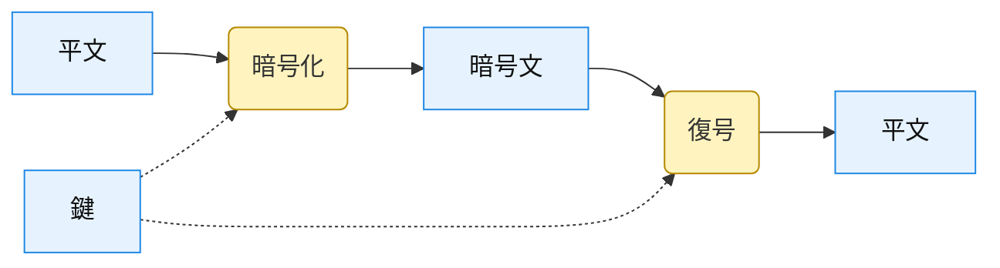
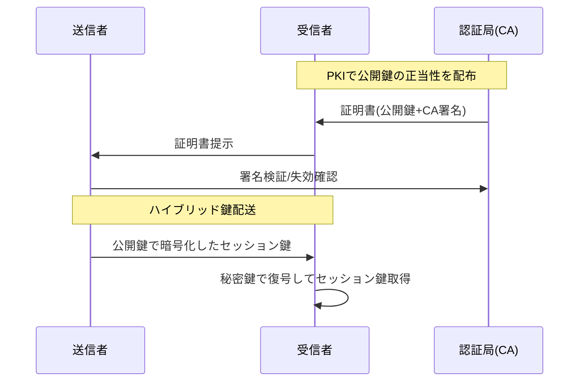
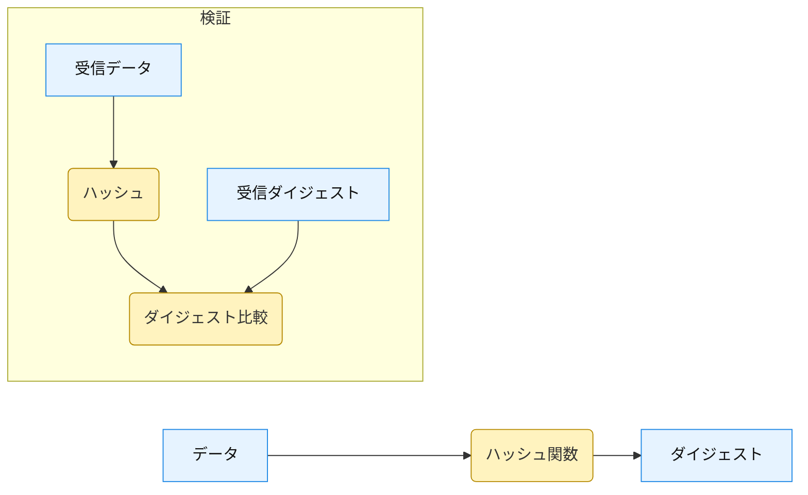
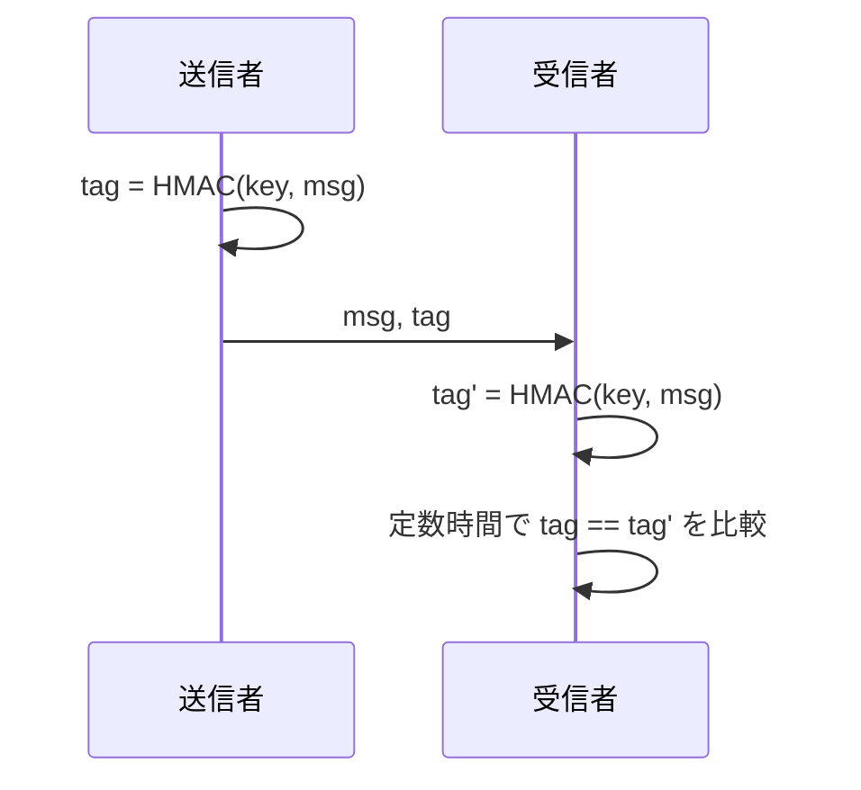
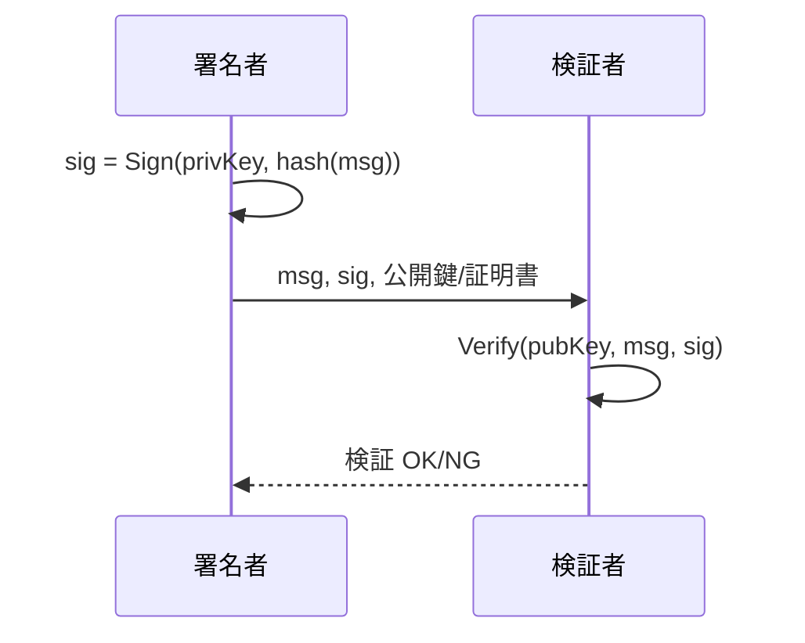
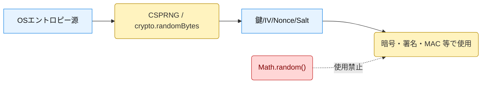

# 暗号技術の基礎まとめ

本リポジトリで扱う暗号技術の主要トピックを、目的・代表方式・注意点・関連実装の観点で簡潔に整理します。

## 1. 暗号（Encryption / Cipher）
- **目的**: 平文を第三者に読めない暗号文へ変換し、正当な鍵保持者のみが復号できるようにする。
- **代表方式**:
  - 対称鍵暗号: AES-GCM、ChaCha20-Poly1305（高速・大容量向き）
  - 公開鍵暗号: RSA-OAEP、楕円曲線（ECIES 等）（鍵配送や小さなデータの暗号化に有効）
- **注意点**:
  - 大きなデータは対称鍵で暗号化し、その鍵を公開鍵暗号で保護する「ハイブリッド暗号」を推奨。
  - AEAD（例: GCM）は機密性と完全性を同時に提供。IV/Nonce の一意性が重要。
- **関連実装**:
  - 対称: `src/symmetric/aes_gcm.ts`
  - 公開鍵（暗号化）: `src/asymmetric/rsa_oaep.ts`
  - 参考説明: `docs/symmetric/README.md`, `docs/asymmetric/README.md`

## 2. 鍵配送（Key Distribution）
- **目的**: 通信当事者が安全に鍵（対称鍵や公開鍵）を共有・配布・更新する。
- **主な手法**:
  - 公開鍵基盤（PKI）: 証明書で公開鍵の正しさを担保し、受け渡しする。
  - 鍵合意: DH/ECDH でセッション鍵を合意（前方秘匿性を実現しやすい）。
  - ハイブリッド暗号: セッション鍵（対称鍵）を RSA-OAEP 等で「鍵封緘」して配送。
  - 鍵管理: ローテーション、KDF（HKDF 等）で鍵派生、KEK/DEK 分離。
- **注意点**:
  - 鍵は決して平文で保存・送信しない。鍵は用途ごとに分離。
  - 乱数品質と IV/Nonce の再利用禁止は必須（配送鍵やセッション鍵にも影響）。
- **関連実装（例）**:
  - RSA-OAEP による小データ暗号化: `src/asymmetric/rsa_oaep.ts`（セッション鍵封緘の構成に応用可）
  - 対称鍵で本データ暗号化: `src/symmetric/aes_gcm.ts`
  - 参考説明: `docs/asymmetric/README.md`, `docs/symmetric/README.md`

## 3. ハッシュ関数（Cryptographic Hash Functions）
- **目的**: 可変長データから固定長ダイジェストを生成し、改ざん検知や識別子として利用。
- **代表方式**: SHA-256 / SHA-512（SHA-2）、SHA3-256 / SHA3-512（SHA-3）
- **注意点**:
  - 衝突耐性・第二原像耐性が求められる。用途に応じた強度選択。
  - パスワード保存には「生ハッシュ不可」。KDF（PBKDF2/scrypt/Argon2）を使用。
- **関連実装**: `src/hash/sha256.ts`
- **参考**: `docs/hash/README.md`

## 4. メッセージ認証コード（MAC）
- **目的**: 共有鍵に基づき、メッセージの完全性と送信元認証を同時に保証。
- **代表方式**: HMAC（例: HMAC-SHA-256）
- **注意点**:
  - 鍵とデータの混同を避け、HMAC を正しい API で使用。
  - 比較はタイミング攻撃対策として定数時間で行う。
- **関連実装**: `src/mac/hmac_sha256.ts`
- **参考**: `docs/mac/README.md`

## 5. デジタル署名（Digital Signatures）
- **目的**: 秘密鍵で署名し、公開鍵で検証することで、完全性と否認防止（署名者の関与の証明）を提供。
- **代表方式**: RSA-PSS、ECDSA、Ed25519（EdDSA）
- **注意点**:
  - 適切な鍵長・曲線選択、署名対象データの正規化。
  - 署名鍵は厳格に保護。公開鍵の正当性確認（PKI）を前提とする。
- **関連実装**: `src/signature/ed25519.ts`
- **参考**: `docs/signature/README.md`

## 6. 擬似乱数生成器（PRNG）/ 暗号用乱数（CSPRNG）
- **目的**: 鍵・IV/Nonce・Salt など安全性に直結する値を予測不能に生成。
- **要点**:
  - 暗号用途は CSPRNG（OS 由来の安全な乱数）を使用。`Math.random()` は不可。
  - Node.js では `crypto.randomBytes()` を使用（IV の例: AES-GCM 実装）。
- **関連実装（利用例）**: `src/symmetric/aes_gcm.ts`（IV 未指定時に 12 バイト乱数生成）

---

### 相互関係のイメージ
- ハイブリッド暗号:「対称鍵で本体暗号化」＋「公開鍵で対称鍵を封緘（配送）」
- 完全性保証: AEAD（例: AES-GCM）または「暗号＋HMAC」
- 否認防止: デジタル署名（公開鍵で検証）
- 乱数: 鍵生成・IV/Nonce・Salt へ供給（CSPRNG が前提）

### 本リポジトリの該当ファイル一覧
- 対称: `src/symmetric/aes_gcm.ts`（説明: `docs/symmetric/README.md`）
- 公開鍵: `src/asymmetric/rsa_oaep.ts`（説明: `docs/asymmetric/README.md`）
- ハッシュ: `src/hash/sha256.ts`（説明: `docs/hash/README.md`）
- MAC: `src/mac/hmac_sha256.ts`（説明: `docs/mac/README.md`）
- 署名: `src/signature/ed25519.ts`（説明: `docs/signature/README.md`）
- セキュリティの6要素: `docs/001_infosec/README.md` 